<div align = "center">
  
  <h1>Universidad Peruana de Ciencias Aplicadas</h1>
<h1>Facultad de Ingeniería</h1>
  <h2>Carrera de Ingeniería de Software</h2>
  <h2>Periodo 2610</h2>
  <h2>1ASI0730 - Aplicaciones Web </h2>
  <h2>NRC- 0730</h2>
  <br>
  <h2>Profesor - Jose Miguel Flores Ingaruca </h2>
  <h2>Informe de Trabajo TB1</h2>
  <br>
  <h2 >Startup - flowqueue </h2>
  <h2 >Producto - </h2>
  <br>
  <h2 >Integrantes</h2>
  <ul style="list-style: none; padding: 0;">
      <li><h3>U202315654 - Pillaca Vidal, Luis Angel</h3></li>
      <li><h3>U202417693 - Alexander Auden Aliaga Ocampo</h3></li>
      <li><h3>u202210764 - Daniel Elias Ruiz Huisa</h3></li>
      <li><h3>u20211b686 - Uribe Linares Francisco Javier</h3></li>
      <li><h3>u202414510 - Mansilla Rivero, Carlos Marcelo</h3></li>
  </ul>
  <br>
  <h4>abril del 2026</h4>
<br>
</div>
<div style="page-break-after: always;"></div>

## Contenido

- [Contenido](#contenido)
- [Student Outcome](#student-outcome)
- [Capítulo 1: Introducción](#capítulo-1-introducción)
  - [1.1. Startup Profile](#11-startup-profile)
    - [1.1.1. Descripción de la Startup](#111-descripción-de-la-startup)
    - [1.1.2. Perfiles de integrantes del equipo](#112-perfiles-de-integrantes-del-equipo)
  - [1.2. Solution Profile](#12-solution-profile)
    - [1.2.1. Antecedentes y problemática](#121-antecedentes-y-problemática)
    - [1.2.2. Lean UX Process](#122-lean-ux-process)
      - [1.2.2.1. Lean UX Problem Statements](#1221-lean-ux-problem-statements)
  - [Segmento — Ciudadanos usuarios de servicios públicos en Lima](#segmento--ciudadanos-usuarios-de-servicios-públicos-en-lima)
  - [Segmento — Personal administrativo de atención](#segmento--personal-administrativo-de-atención)
  - [Segmento — Supervisores o responsables de sede](#segmento--supervisores-o-responsables-de-sede)
      - [1.2.2.2. Lean UX Assumptions](#1222-lean-ux-assumptions)
      - [1.2.2.3. Lean UX Hypothesis Statements](#1223-lean-ux-hypothesis-statements)
      - [1.2.2.4. Lean UX Canvas](#1224-lean-ux-canvas)
  - [1.3. Segmentos objetivo](#13-segmentos-objetivo)
    - [Segmento objetivo 1: Ciudadanos usuarios de servicios públicos](#segmento-objetivo-1-ciudadanos-usuarios-de-servicios-públicos)
    - [Segmento objetivo 2: Personal administrativo de atención](#segmento-objetivo-2-personal-administrativo-de-atención)
    - [Segmento objetivo 3: Responsables o administradores de sede](#segmento-objetivo-3-responsables-o-administradores-de-sede)
- [Capítulo II: Requirements Elicitation \& Analysis](#capítulo-ii-requirements-elicitation--analysis)
  - [2.1. Competidores](#21-competidores)
    - [2.1.1. Análisis competitivo](#211-análisis-competitivo)
  - [Debilidades](#debilidades)
  - [Oportunidades](#oportunidades)
  - [Amenazas](#amenazas)
    - [2.1.2. Estrategias y tácticas frente a competidores](#212-estrategias-y-tácticas-frente-a-competidores)
  - [2.2. Entrevistas](#22-entrevistas)
- [2.2.1. Diseño de entrevistas](#221-diseño-de-entrevistas)
  - [Segmentos a entrevistar](#segmentos-a-entrevistar)
  - [Datos generales a recolectar](#datos-generales-a-recolectar)
  - [Ciudadanos usuarios de servicios públicos (Segmento 1)](#ciudadanos-usuarios-de-servicios-públicos-segmento-1)
  - [Preguntas para personal administrativo (Segmento 2)](#preguntas-para-personal-administrativo-segmento-2)
  - [Preguntas para supervisores o responsables de sede (Segmento 3)](#preguntas-para-supervisores-o-responsables-de-sede-segmento-3)
    - [2.2.2. Registro de entrevistas](#222-registro-de-entrevistas)
  - [Resumen](#resumen)
  - [Resumen](#resumen-1)
  - [Resumen](#resumen-2)
  - [Resumen](#resumen-3)
  - [Resumen](#resumen-4)
  - [2.3. NeedFinding](#23-needfinding)
    - [2.3.1. User Personas](#231-user-personas)
- [2.3.2. User Task Matrix](#232-user-task-matrix)
  - [User Task Matrix – Citizen](#user-task-matrix--citizen)
  - [User Task Matrix – Counter Operator](#user-task-matrix--counter-operator)
  - [User Task Matrix – Supervisor](#user-task-matrix--supervisor)
    - [2.3.3. User Journey Mapping](#233-user-journey-mapping)
    - [2.3.4. Empathy Mapping](#234-empathy-mapping)
  - [2.4. Big Picture EventStorming](#24-big-picture-eventstorming)
- [2.5. Ubiquitous Language](#25-ubiquitous-language)
- [Capítulo III: Requirements Specification](#capítulo-iii-requirements-specification)
- [3.1. User Stories](#31-user-stories)
  - [3.2. Impact Mapping](#32-impact-mapping)
- [3.3. Product Backlog](#33-product-backlog)
- [Capítulo IV: Product Design](#capítulo-iv-product-design)
  - [4.1. Style Guidelines](#41-style-guidelines)
  - [4.1.1 General Style Guidelines](#411-general-style-guidelines)
    - [Branding](#branding)
    - [Colores](#colores)
    - [Tipografía](#tipografía)
    - [Espaciado](#espaciado)
  - [4.4.2 Web Style Guidelines](#442-web-style-guidelines)
    - [Layout \& Grid System](#layout--grid-system)
      - [Grid principal](#grid-principal)
    - [Estructura por tipo de vista](#estructura-por-tipo-de-vista)
    - [Patrones de Interacción](#patrones-de-interacción)
      - [Estado de botones](#estado-de-botones)
  - [4.2. Information Architecture](#42-information-architecture)
    - [4.2.1. Organization Systems](#421-organization-systems)
  - [4.2.2 Labeling Systems](#422-labeling-systems)
    - [Navegación Principal — Navbar](#navegación-principal--navbar)
    - [Sección Hero — Home](#sección-hero--home)
    - [Métricas destacadas](#métricas-destacadas)
    - [Estados de turno](#estados-de-turno)
    - [Roles de usuario](#roles-de-usuario)
    - [Formularios y campos](#formularios-y-campos)
    - [Criterios generales aplicados](#criterios-generales-aplicados)
  - [4.2.3 SEO Tags and Meta Tags](#423-seo-tags-and-meta-tags)
    - [Estructura Base HTML](#estructura-base-html)
  - [4.2.4 Searching Systems](#424-searching-systems)
- [Requerimientos funcionales](#requerimientos-funcionales)
- [Opciones de tecnología](#opciones-de-tecnología)
  - [Comparativa de alternativas](#comparativa-de-alternativas)
- [Tecnología seleccionada para el MVP](#tecnología-seleccionada-para-el-mvp)
- [Esquema de índice](#esquema-de-índice)
- [Campos principales del índice](#campos-principales-del-índice)
- [Ejemplos de búsqueda](#ejemplos-de-búsqueda)
  - [Búsqueda de ciudadano](#búsqueda-de-ciudadano)
  - [Búsqueda de operador](#búsqueda-de-operador)
  - [Búsqueda de supervisor](#búsqueda-de-supervisor)
  - [4.2.5 Navigation Systems](#425-navigation-systems)
  - [4.3. Landing Page UI Design](#43-landing-page-ui-design)
  - [4.3.1 Landing Page Wireframe](#431-landing-page-wireframe)
- [Desktop Web Browser](#desktop-web-browser)
- [Mobile Web Browser](#mobile-web-browser)
- [Diseño inclusivo aplicado](#diseño-inclusivo-aplicado)
    - [4.3.2. Landing Page Mock-up](#432-landing-page-mock-up)
  - [4.4. Web Applications UX/UI Design](#44-web-applications-uxui-design)
    - [4.4.1. Web Applications Wireframes](#441-web-applications-wireframes)
  - [4.4.2 Web Applications Wireflow Diagrams](#442-web-applications-wireflow-diagrams)
    - [User Goal 1](#user-goal-1)
    - [User Goal 2](#user-goal-2)
    - [User Goal 3](#user-goal-3)
  - [4.4.3 Web Applications Mock-ups](#443-web-applications-mock-ups)
    - [4.4.4. Web Applications User Flow Diagrams](#444-web-applications-user-flow-diagrams)
  - [4.5 Web Applications Prototyping](#45-web-applications-prototyping)
  - [4.5.2 Mobile Web Browser Prototype](#452-mobile-web-browser-prototype)
  - [4.6. Domain-Driven Software Architecture](#46-domain-driven-software-architecture)
    - [4.6.1. Domain-Level EventStorming](#461-domain-level-eventstorming)
  - [4.6.2 Software Architecture Context Diagram](#462-software-architecture-context-diagram)
    - [Actores del sistema](#actores-del-sistema)
    - [Sistemas externos](#sistemas-externos)
    - [4.6.3. Software Architecture Container Diagrams](#463-software-architecture-container-diagrams)
    - [4.6.4. Software Architecture Components Diagrams](#464-software-architecture-components-diagrams)
  - [4.7. Software Object-Oriented Design](#47-software-object-oriented-design)
  - [4.7.1 Class Diagrams](#471-class-diagrams)
  - [4.8. Database Design](#48-database-design)
    - [4.8.1. Database Diagrams](#481-database-diagrams)
- [Capítulo V: Product Implementation, Validation \& Deployment](#capítulo-v-product-implementation-validation--deployment)
  - [5.1. Software Configuration Management](#51-software-configuration-management)
    - [5.1.1. Software Development Environment Configuration](#511-software-development-environment-configuration)
    - [5.1.2. Source Code Management](#512-source-code-management)
    - [5.1.3. Source Code Style Guide \& Conventions](#513-source-code-style-guide--conventions)
    - [5.1.4. Software Deployment Configuration](#514-software-deployment-configuration)
  - [5.2. Landing Page, Services \& Applications Implementation](#52-landing-page-services--applications-implementation)
    - [5.2.1. Sprint 1](#521-sprint-1)

## Student Outcome

El curso contribuye al cumplimiento del Student Outcome ABET:

**ABET – EAC - Student Outcome 5**

**Criterio:** : La capacidad de funcionar efectivamente en un equipo cuyos miembros
juntos proporcionan liderazgo, crean un entorno de colaboración e inclusivo,
establecen objetivos, planifican tareas y cumplen objetivos.

| Criterio específico | Acciones realizadas | Conclusiones |
|---------------------|--------------------|--------------|
|Trabaja en equipo para proporcionar liderazgo en forma conjunta|**TB1:**|**TB1:**              |
|Crea un entorno colaborativo e inclusivo, establece metas, planifica tareas y cumple objetivos.|**TB1:** |**TB1:** |


  ## Capítulo 1: Introducción
### 1.1. Startup Profile
Como peruanos y como equipo hemos creado FlowQueue, tiene como objetivo principal abordar la ineficiencia en la gestión de atención al público en instituciones del Perú, caracterizada por largas filas, tiempos de espera impredecibles y falta de transparencia en el orden de atención.
En entidades como RENIEC, EsSalud y Banco de la Nación, los usuarios enfrentan diariamente problemas relacionados con la organización de colas, lo que genera pérdida de tiempo, estrés y una mala experiencia de servicio.
En respuesta a esta problemática, hemos desarrollado la plataforma FlowQueue, un sistema web de gestión de colas virtuales que permite a las instituciones administrar turnos de atención de manera digital. La solución permite a los usuarios obtener tickets en línea, visualizar su posición en la cola en tiempo real y conocer el tiempo estimado de atención, reduciendo significativamente la necesidad de filas físicas.
#### 1.1.1. Descripción de la Startup
FlowQueue es una startup tecnológica enfocada en la digitalización y optimización de procesos de atención al cliente en instituciones públicas y privadas.
Nuestra plataforma funciona como un sistema centralizado de gestión de colas que permite:
Crear y administrar turnos virtuales por sede y tipo de servicio
Asignar tickets digitales a los usuarios
Visualizar el estado de atención en tiempo real
Estimar tiempos de espera dinámicamente
Gestionar múltiples sedes desde un único sistema
El sistema está diseñado con una arquitectura web moderna que integra un frontend interactivo con un backend robusto, permitiendo manejar múltiples usuarios concurrentes y actualizaciones en tiempo real.
A diferencia de soluciones tradicionales, FlowQueue no solo digitaliza el proceso de filas, sino que introduce herramientas de monitoreo, control y análisis que mejoran la eficiencia operativa de las instituciones y la experiencia del usuario.
La plataforma ofrece diferentes niveles de acceso, incluyendo usuarios finales (clientes) y administradores (personal de atención), garantizando una gestión estructurada y escalable del servicio.


#### 1.1.2. Perfiles de integrantes del equipo
<table>
  <tr>
    <th colspan="2"> Alexander Auden Aliaga Ocampo </th>
  </tr>
  <tr>
    <td>  </td>
    <td> Soy estudiante de ingeniería de software en la UPC, con conocimientos básicos en los lenguajes de programación como c++, python , css, html, javascript también conocimientos básicos en base de datos viendo Mongo DB y creando diagramas relaciones como no relacionales. Además poseo habilidades de empatía y buena comunicación con el equipo esto me permite ser productivo en el ámbito de grupos y en general. </td>
  </tr>
</table>

### 1.2. Solution Profile
#### 1.2.1. Antecedentes y problemática
En el Perú, miles de ciudadanos realizan diariamente trámites y solicitudes en entidades públicas del Estado, como registros de identidad, servicios de salud, bancos estatales y otras instituciones de atención masiva. Sin embargo, gran parte de estos procesos continúa desarrollándose mediante colas presenciales, tiempos de espera prolongados y poca visibilidad sobre el orden de atención. Esta situación genera incomodidad, pérdida de tiempo y una experiencia negativa para los usuarios, especialmente cuando deben reorganizar sus actividades personales, académicas o laborales para poder ser atendidos.
Aplicando la técnica de las 5W + 2H, se identifica lo siguiente:
 Who: ciudadanos que acuden a servicios públicos del Estado, así como personal administrativo encargado de organizar la atención.
 What: largas colas de espera, desorden en el flujo de atención y falta de información en tiempo real sobre los turnos.
 Where: entidades públicas de atención presencial en el Perú, especialmente aquellas con alta afluencia de usuarios.
 When: durante los horarios de atención en los que se concentran trámites, consultas o pagos.
 Why: porque muchos servicios todavía dependen de sistemas manuales o poco digitalizados para gestionar turnos y priorizar la atención.
 How: los usuarios deben acudir físicamente, esperar por largos periodos y depender de información limitada o poco clara.
 How much: esto se traduce en tiempo perdido, estrés, congestión en los establecimientos y menor eficiencia operativa para las instituciones.
A partir de ello, la problemática principal del proyecto se define como la ineficiencia en la gestión de colas de espera en servicios públicos del Estado, la cual afecta tanto a los ciudadanos como al personal que administra la atención. Por un lado, los usuarios enfrentan esperas extensas, incertidumbre y una experiencia poco satisfactoria. Por otro lado, las instituciones tienen dificultades para ordenar el flujo de personas, distribuir adecuadamente sus recursos y ofrecer una atención más transparente y predecible.
Frente a este contexto, la propuesta del equipo consiste en desarrollar una solución digital que permita gestionar colas de manera virtual, brindando a los usuarios la posibilidad de obtener un turno, visualizar su posición en la fila y estimar su tiempo de espera, mientras que el personal administrativo podrá monitorear y organizar la atención de forma más eficiente. El objetivo principal es reducir tiempos muertos, mejorar la experiencia del ciudadano y optimizar la gestión operativa de los servicios públicos.
Como delimitación inicial del proyecto, la solución se enfocará en instituciones públicas con alta demanda de atención presencial, y se implementará como una plataforma web accesible desde distintos dispositivos. Además, el alcance estará orientado a resolver el problema de organización y seguimiento de turnos, no a reemplazar el trámite en sí ni los procesos internos propios de cada entidad.

#### 1.2.2. Lean UX Process
##### 1.2.2.1. Lean UX Problem Statements

### Segmento — Ciudadanos usuarios de servicios públicos en Lima

**Contexto:**  
Los ciudadanos que acuden a entidades públicas de atención al público, como RENIEC, EsSalud y Banco de la Nación, necesitan realizar trámites, consultas o pagos de forma rápida y ordenada. Buscan reducir tiempos de espera, evitar largas filas presenciales y contar con mayor visibilidad sobre su turno de atención.

**Observación:**  
Actualmente, los usuarios suelen enfrentarse a colas físicas extensas, tiempos de espera impredecibles y poca información sobre el estado real de la atención. En muchos casos, deben llegar con anticipación y permanecer largos periodos en el establecimiento sin certeza de cuándo serán atendidos, lo que genera pérdida de tiempo, incomodidad y estrés.

**Problema:**  
No existe una solución digital accesible y centralizada que permita a los ciudadanos obtener un turno de atención de manera remota, visualizar su posición en la cola en tiempo real y estimar con mayor precisión cuánto falta para ser atendidos.

**Pregunta clave:**  
¿Cómo diseñar una plataforma web que permita a los ciudadanos obtener turnos virtuales, monitorear en tiempo real el avance de la cola y optimizar su tiempo de espera en instituciones públicas de alta demanda?


### Segmento — Personal administrativo de atención

**Contexto:**  
El personal administrativo de instituciones públicas debe gestionar diariamente grandes volúmenes de usuarios, organizar el flujo de atención y procurar que el servicio sea lo más ordenado y eficiente posible. Sus funciones suelen estar relacionadas con la recepción, orientación, asignación de turnos y control del flujo de personas durante la atención.

**Observación:**  
En muchos casos, la gestión de colas todavía se realiza manualmente o mediante procesos poco eficientes, lo que ocasiona desorden, dificultades para controlar prioridades, retrasos en la atención y ausencia de métricas claras para evaluar el desempeño del servicio.

**Problema:**  
Las instituciones no cuentan con una herramienta digital centralizada que permita al personal administrativo gestionar turnos de manera eficiente, supervisar el flujo de atención en tiempo real y mejorar la organización del servicio.

**Pregunta clave:**  
¿Cómo implementar una plataforma web que permita al personal administrativo gestionar colas, controlar el estado de los turnos en tiempo real y optimizar la eficiencia operativa de la atención al público?

### Segmento — Supervisores o responsables de sede

**Contexto:**  
Los supervisores o responsables de sede tienen a su cargo el monitoreo del servicio de atención al ciudadano dentro de una oficina o en varias sedes de una misma institución. Necesitan conocer indicadores de tiempo de espera, volumen de usuarios y desempeño general de la atención para tomar decisiones que mejoren la operación.

**Observación:**  
La falta de un sistema centralizado dificulta la supervisión unificada del servicio, limita la comparación del rendimiento entre horarios o sedes y reduce la capacidad de tomar decisiones oportunas sobre redistribución de recursos y personal.

**Problema:**  
No existe una solución que permita a los responsables de sede monitorear la atención en tiempo real, visualizar indicadores clave y tomar decisiones basadas en datos para optimizar el servicio brindado al ciudadano.

**Pregunta clave:**  
¿Cómo diseñar una plataforma web que permita a los supervisores o responsables de sede monitorear el flujo de atención, identificar oportunidades de mejora y optimizar la distribución de recursos de manera eficiente?

##### 1.2.2.2. Lean UX Assumptions

  Assumptions Worksheet

En esta sección declaramos las suposiciones fundamentales sobre nuestro modelo de negocio y el comportamiento de los usuarios.

- **¿Quién es el usuario?**  
  Ciudadanos peruanos que realizan trámites en instituciones con alta demanda y personal administrativo de dichas entidades.

- **¿Dónde encaja nuestro producto?**  
  En el proceso de espera y gestión de turnos, sustituyendo la fila física por una virtual.

- **¿Qué problemas resolvemos?**  
  Pérdida de tiempo del usuario, falta de información en tiempo real, desorden administrativo y falta de métricas operativas en las instituciones.

- **¿Cuándo y cómo se usa nuestro producto?**  
  Se usa desde el dispositivo móvil del usuario antes de llegar o al llegar a la sede, y por el personal administrativo a través de una interfaz de gestión durante su jornada laboral.

- **¿Qué valor ofrecemos?**  
  Predictibilidad y ahorro de tiempo para el ciudadano; eficiencia y control de datos para la institución.

 Business Outcomes

Estos son los resultados medibles que FlowQueue espera lograr para las instituciones que adopten el sistema:

- **Reducción del tiempo promedio de espera:**  
  Lograr una disminución del 30% en el tiempo que los usuarios pasan físicamente en las instalaciones.

- **Aumento en la satisfacción del cliente:**  
  Incrementar el puntaje de satisfacción (NPS) del servicio de atención al público en un 25%.

- **Optimización de recursos:**  
  Reducción del 15% en costos operativos relacionados con la gestión manual de colas y personal de seguridad para control de filas.

- **Toma de decisiones basada en datos:**  
  Generación de reportes semanales de afluencia por sede que permitan ajustar el personal según la demanda real.

 Users

Identificamos los segmentos específicos que interactúan con la plataforma:

- **Usuarios Finales (Ciudadanos):**  
  Personas de entre 18 y 65 años que necesitan realizar trámites en RENIEC, EsSalud o Banco de la Nación y buscan optimizar su tiempo.

- **Personal de Atención (Operadores):**  
  Trabajadores de las instituciones que gestionan el llamado de turnos y la atención directa.

- **Administradores de Sede:**  
  Encargados de monitorear el flujo general de una o varias oficinas y generar reportes de rendimiento.

 User Outcomes

Lo que los usuarios esperan lograr o sentir al usar FlowQueue:

- **Sentido de Control:**  
  El usuario siente que tiene el control de su tiempo al saber exactamente cuántas personas hay delante de él.

- **Reducción del estrés:**  
  Menor ansiedad al no tener que estar físicamente de pie en una fila larga e incierta.

- **Eficiencia Laboral (Administrativos):**  
  El personal siente que su trabajo es más organizado y menos caótico, permitiéndoles enfocarse en la atención y no en el orden de la fila.

- **Transparencia:**  
  El usuario confía en que el sistema de turnos es justo y no existen saltos en el orden de llegada.

 Features

Funcionalidades clave que implementaremos para cumplir con los resultados anteriores:

- **Generación de Ticket Virtual:**  
  Los usuarios pueden obtener un turno digital desde el Landing Page o Web App sin estar presentes.

- **Monitor en Tiempo Real:**  
  Visualización dinámica de la posición actual y el tiempo estimado para ser atendido.

- **Sistema de Notificaciones:**  
  Alertas automáticas cuando el turno del usuario esté próximo a ser llamado.

- **Dashboard Administrativo:**  
  Interfaz para que el personal gestione la cola, asigne prioridades y marque turnos como completados.

- **Módulo de Analítica:**  
  Herramientas de reporte para visualizar tiempos de espera históricos y picos de demanda por sede.

- **Gestión Multi-Sede:**  
  Capacidad de administrar diferentes ubicaciones geográficas desde una única cuenta de administrador corporativo.

##### 1.2.2.3. Lean UX Hypothesis Statements

Estas validan si FlowQueue funciona como negocio y aporta valor a las instituciones.

 Hypothesis de negocio

- **Hipótesis 1 – Reducción de tiempos:**  
  Creemos que implementar un sistema de turnos virtuales en instituciones públicas reducirá el tiempo promedio de espera presencial de los usuarios. Sabremos que esto es cierto si el tiempo de permanencia en sede disminuye al menos en un 30% dentro de los primeros 3 meses.

- **Hipótesis 2 – Satisfacción del cliente:**  
  Creemos que brindar información en tiempo real sobre el estado de la cola aumentará la satisfacción del usuario. Sabremos que esto es cierto si el NPS aumenta en un 25% tras la implementación.

- **Hipótesis 3 – Reducción de costos operativos:**  
  Creemos que digitalizar la gestión de colas reducirá la necesidad de personal dedicado al control físico de filas. Sabremos que esto es cierto si los costos operativos asociados disminuyen en al menos un 15%.

- **Hipótesis 4 – Toma de decisiones basada en datos:**  
  Creemos que proporcionar reportes de analítica permitirá a las instituciones optimizar la asignación de personal. Sabremos que esto es cierto si los administradores utilizan los reportes semanalmente y logran ajustar horarios o recursos en al menos 1 decisión operativa por semana.

- **Hipótesis 5 – Adopción del sistema:**  
  Creemos que las instituciones con alta demanda adoptarán un sistema digital de colas si mejora su eficiencia operativa. Sabremos que esto es cierto si al menos el 60% de las sedes piloto continúan usando el sistema después de 2 meses.

 Hypothesis de usuarios

- **Hipótesis 1 – Uso antes de llegar:**  
  Creemos que los ciudadanos preferirán obtener su turno antes de llegar a la sede usando su celular. Sabremos que esto es cierto si al menos el 70% de los tickets se generan de forma remota.

- **Hipótesis 2 – Reducción de estrés:**  
  Creemos que visualizar su posición en la cola reducirá la ansiedad del usuario. Sabremos que esto es cierto si el 80% de los usuarios reporta menor estrés en encuestas post-servicio.

- **Hipótesis 3 – Confianza en el sistema:**  
  Creemos que un sistema transparente de turnos aumentará la confianza del usuario en el proceso. Sabremos que esto es cierto si menos del 5% de los usuarios reporta quejas por desorden o injusticia en la fila.

- **Hipótesis 4 – Uso de notificaciones:**  
  Creemos que los usuarios dependen de notificaciones para acercarse a tiempo a su turno. Sabremos que esto es cierto si al menos el 65% de los usuarios llega justo antes de ser llamado, en lugar de esperar físicamente.
  

- **Hipótesis 5 – Eficiencia del personal:**  
  Creemos que los operadores podrán gestionar turnos más eficientemente con un dashboard digital. Sabremos que esto es cierto si el tiempo promedio de atención por usuario se reduce o se mantiene estable con mayor volumen.


##### 1.2.2.4. Lean UX Canvas

| **Sección** | **Descripción** |
|------------|-----------------|
| **1. Problema / Oportunidad** | En instituciones públicas del Perú, como RENIEC, EsSalud y Banco de la Nación, los usuarios enfrentan largas filas, tiempos de espera impredecibles y poca transparencia en el orden de atención. Esto genera pérdida de tiempo, estrés y una mala experiencia de servicio. FlowQueue busca digitalizar y optimizar la gestión de colas mediante una plataforma web de turnos virtuales y monitoreo en tiempo real. |
| **2. Usuarios y Clientes** | **Usuarios:** Ciudadanos que realizan trámites en instituciones públicas, personal administrativo de atención y supervisores o responsables de sede. <br> **Clientes:** Instituciones públicas que necesitan optimizar su atención al ciudadano, reducir tiempos de espera y mejorar el control operativo de sus sedes. |
| **3. Supuestos** | Los ciudadanos adoptarán una solución digital si les permite ahorrar tiempo y conocer el estado de su turno en tiempo real; el personal administrativo utilizará la plataforma si simplifica la gestión de colas y mejora la organización de la atención; los supervisores o responsables de sede valorarán la solución si les proporciona métricas útiles para monitorear el servicio y tomar decisiones; las instituciones estarán dispuestas a implementar la solución si reduce tiempos de espera, mejora la satisfacción del usuario y optimiza la operación. |
| **4. Necesidades del Usuario** | Obtener turnos sin hacer filas físicas, conocer la posición en la cola, recibir información clara sobre el tiempo estimado de atención, gestionar turnos en tiempo real, priorizar casos cuando sea necesario, monitorear el flujo de atención, acceder a reportes, identificar horas pico y optimizar recursos en la sede. |
| **5. Solución Propuesta** | Plataforma web orientada a la gestión de colas virtuales en instituciones públicas, desarrollada para permitir a los ciudadanos generar tickets digitales, visualizar su posición en la cola y recibir notificaciones sobre su turno, mientras que el personal administrativo podrá gestionar la atención y los supervisores accederán a reportes e indicadores para el monitoreo del servicio. |
| **6. Resultados (Outcomes)** | **Resultados esperados:** Reducción del tiempo de espera presencial, mejora en la experiencia del ciudadano, mayor organización del flujo de atención y mejor capacidad de supervisión institucional. <br> **KPIs:** Tiempo promedio de espera, cantidad de tickets generados, porcentaje de usuarios atendidos a tiempo, nivel de satisfacción del usuario, frecuencia de uso del sistema y número de sedes activas. |
| **7. Experimentos** | Pruebas de usabilidad con usuarios potenciales, validación del flujo de generación de ticket virtual, simulación del monitoreo de cola en tiempo real, pruebas del dashboard administrativo, evaluación del módulo de métricas y encuestas para comprobar que el MVP cubre las necesidades esenciales de ciudadanos, personal administrativo y supervisores. |
| **8. MVP (Producto Mínimo Viable)** | Registro e inicio de sesión, selección de entidad o sede, selección de trámite, generación de ticket virtual, visualización de posición en la cola, tiempo estimado de atención, notificaciones previas, dashboard administrativo para gestionar turnos y panel básico de métricas para supervisión. |

### 1.3. Segmentos objetivo

#### Segmento objetivo 1: Ciudadanos usuarios de servicios públicos
Este segmento está conformado por personas que acuden a entidades públicas del Estado para realizar trámites, consultas, pagos o solicitudes. Incluye jóvenes, adultos y adultos mayores, generalmente entre los 18 y 65 años, residentes en zonas urbanas, que valoran la rapidez, el orden y la previsibilidad en la atención. Muchos de ellos utilizan teléfonos móviles y servicios digitales básicos, por lo que podrían adaptarse a una solución web que les permita gestionar su turno sin permanecer físicamente en una cola por largos periodos.

**Sus principales necesidades son:**
- reducir el tiempo de espera,
- evitar aglomeraciones,
- conocer con claridad cuándo serán atendidos,
- y tener una experiencia más ordenada y menos estresante.

#### Segmento objetivo 2: Personal administrativo de atención
Este segmento incluye a los trabajadores responsables de organizar la atención al público dentro de las instituciones estatales. Suelen desempeñar funciones vinculadas con recepción, orientación, asignación de turnos y control del flujo de usuarios. Requieren herramientas que les permitan visualizar la cola en tiempo real, priorizar casos cuando corresponda y mantener un mayor control operativo.

**Sus necesidades principales son:**
- organizar de forma eficiente el flujo de usuarios,
- reducir el desorden en la atención,
- mejorar la distribución de turnos,
- y contar con información útil para tomar decisiones operativas.

#### Segmento objetivo 3: Responsables o administradores de sede
Este segmento agrupa a supervisores o encargados de una sede o área de atención. Tienen interés en monitorear indicadores de tiempo de espera, volumen de usuarios y desempeño del servicio. Buscan soluciones que no solo ayuden a ordenar la atención, sino que también generen datos para evaluar mejoras en la operación.

**Sus principales necesidades son:**
- supervisar la atención de forma centralizada,
- identificar horas pico,
- optimizar recursos,
- y mejorar la calidad del servicio brindado al ciudadano.

## Capítulo II: Requirements Elicitation & Analysis

### 2.1. Competidores

En el mercado existen diversas soluciones que abordan la gestión de colas y atención al cliente, tanto a nivel local como internacional. Los principales competidores identificados son:
<b>Competidores directos:</b>
- <b>Qmatic</b>
  Plataforma global especializada en sistemas de gestión de colas y experiencia del cliente en instituciones públicas y privadas.
- Turnero (sistemas de turnos digitales locales)
 Soluciones implementadas por algunas entidades en Perú o LATAM que permiten asignación básica de turnos, generalmente sin monitoreo en tiempo real avanzado.
- <b>Queue-it</b>
 Sistema enfocado en la gestión de colas virtuales principalmente para tráfico web (ej. alta demanda en sitios), pero aplicable a gestión de acceso.
<b>Competidores indirectos:</b>
- <b>Sistemas manuales o semi-digitales</b>
 (tickets físicos, Excel, atención por orden de llegada).
- **Aplicaciones internas de instituciones**
 Algunas entidades desarrollan sistemas propios limitados a una sola sede o servicio.
- **Plataformas de citas previas**
 Sistemas que permiten agendar citas, pero no gestionan colas dinámicas en tiempo real.

#### 2.1.1. Análisis competitivo
Competitive Analysis Landscape

 ¿Por qué llevar a cabo este análisis?

- Identificar las brechas existentes en el mercado peruano.
- Evaluar las fortalezas y limitaciones de los competidores directos e indirectos.
- Definir estrategias de diferenciación para SafeHome, enfocadas en accesibilidad, integración IoT y una plataforma web responsive.
- Validar que la solución propuesta responde a necesidades reales no cubiertas de manera integral.

---

**Competidores**

**Overview**
| Overview | FlowQueue | Qminder | QLess | Inalto |
|----------|----------|---------|-------|--------|
| | FlowQueue es una startup peruana que ofrece una plataforma web de gestión de colas virtuales orientada a instituciones públicas y privadas. | Qminder es una plataforma SaaS global especializada en la gestión de colas y experiencia del cliente. | QLess es un sistema de colas virtuales basado en la nube con registro remoto. | Inalto es una empresa peruana con sistema híbrido que integra web/app con hardware. |

---

**Perfil**

**Ventaja competitiva**

| Ventaja competitiva | FlowQueue | Qminder | QLess | Inalto |
|---------------------|----------|---------|-------|--------|
| | - Plataforma 100% web<br>- Sin instalación ni hardware<br>- Adaptado al contexto peruano<br>- Reducción de tiempos de espera<br>- Escalabilidad multi-sede | - Plataforma madura internacional<br>- Notificaciones automatizadas<br>- Analítica avanzada<br>- Integraciones empresariales | - Eliminación total de filas físicas<br>- Plataforma cloud escalable<br>- Enfoque UX<br>- Implementación multisector | - Presencia local<br>- Solución hardware + software<br>- Adaptabilidad sectorial<br>- Soporte técnico local |

---

**Perfil de marketing**

**Mercado objetivo**

| Mercado Objetivo | FlowQueue | Qminder | QLess | Inalto |
|-----------------|----------|---------|-------|--------|
| | Instituciones públicas y privadas peruanas | Empresas globales, hospitales, bancos, universidades | Empresas globales, hospitales, bancos, universidades | Empresas peruanas con infraestructura física |

**Estrategias de marketing**

| Estrategias | FlowQueue | Qminder | QLess | Inalto |
|------------|----------|---------|-------|--------|
| | - Alianzas con el Estado<br>- Pilotos institucionales<br>- Enfoque GovTech | - Marketing digital global<br>- SaaS B2B<br>- Casos de éxito | - Marketing digital global<br>- SaaS B2B<br>- Casos de éxito | - Ventas directas<br>- Implementaciones personalizadas<br>- Relación comercial local |

---

**Perfil de producto**

**Productos & Servicios**

| Productos & Servicios | FlowQueue | Qminder | QLess | Inalto |
|----------------------|----------|---------|-------|--------|
| | Plataforma web + monitoreo en tiempo real | SaaS de gestión de filas + analítica + notificaciones | SaaS de gestión de filas + analítica + notificaciones | Sistema híbrido (software + kioscos + pantallas) |

**Precios y costos**

| Precios y Costos | FlowQueue | Qminder | QLess | Inalto |
|------------------|----------|---------|-------|--------|
| | SaaS accesible (suscripción) | Suscripción SaaS (costo medio-alto) | Suscripción SaaS (costo medio-alto) | Costos altos por implementación + hardware |

**Canales**

| Canales | FlowQueue | Qminder | QLess | Inalto |
|---------|----------|---------|-------|--------|
| | Web responsive | Web + móvil | Web + móvil | Web + app + hardware físico |

---

**Análisis SWOT**

**Fortalezas**

| Fortalezas | FlowQueue | Qminder | QLess | Inalto |
|-----------|----------|---------|-------|--------|
| | - Adaptado a Perú<br>- 100% web<br>- Bajo costo<br>- Enfoque UX | - SaaS consolidado<br>- Presencia internacional<br>- Analítica avanzada<br>- Alta confiabilidad | - Eliminación de filas<br>- Cloud escalable<br>- UX optimizada<br>- Experiencia multisector | - Presencia local<br>- Solución completa<br>- Soporte técnico<br>- Experiencia implementación |

---

### Debilidades

| Debilidades | FlowQueue | Qminder | QLess | Inalto |
|------------|----------|---------|-------|--------|
| | - Bajo reconocimiento<br>- Recursos limitados<br>- Dependencia institucional<br>- Menor desarrollo tecnológico | - Costos elevados<br>- No adaptado a Perú<br>- Dependencia técnica | - Costos altos<br>- Enfoque global<br>- Dependencia conectividad | - Dependencia hardware<br>- Implementación compleja<br>- Menor flexibilidad<br>- Escalabilidad limitada |

---

### Oportunidades

| Oportunidades | FlowQueue | Qminder | QLess | Inalto |
|--------------|----------|---------|-------|--------|
| | - Digitalización del sector público<br>- Alta demanda<br>- Falta de soluciones locales<br>- Expansión LATAM | - Expansión LATAM<br>- Adopción cloud<br>- Integraciones empresariales | - Crecimiento GovTech<br>- Sector público<br>- Digitalización | - Digitalización empresas<br>- Proyectos institucionales<br>- Modernización |

---

### Amenazas

| Amenazas | FlowQueue | Qminder | QLess | Inalto |
|----------|----------|---------|-------|--------|
| | - Competidores globales<br>- Soluciones híbridas<br>- Resistencia al cambio<br>- Presupuesto estatal | - Competidores económicos<br>- Barreras culturales<br>- Regulaciones | - Nuevos SaaS<br>- Limitación local<br>- Competencia híbrida | - SaaS simples<br>- Competidores internacionales<br>- Cambio a web |

#### 2.1.2. Estrategias y tácticas frente a competidores

En un mercado donde existen soluciones internacionales consolidadas como Qminder y QLess, así como alternativas locales como Inalto EIRL, FlowQueue adopta una estrategia competitiva basada en la diferenciación por accesibilidad, simplicidad y adaptación al contexto peruano.
A continuación, se detallan las principales estrategias y tácticas:
1. Estrategia de diferenciación por accesibilidad
FlowQueue se posiciona como una solución ligera y fácil de implementar, eliminando la necesidad de hardware especializado o instalaciones complejas.
Tácticas:
   - Plataforma 100% web accesible desde cualquier dispositivo
   - Interfaz intuitiva enfocada en usuarios no técnicos
   - Eliminación de barreras de entrada (sin app obligatoria ni equipos físicos)


2. Estrategia de enfoque en el mercado local (Perú)
A diferencia de competidores globales, FlowQueue se adapta a las necesidades específicas de las instituciones peruanas.
Tácticas:
   - Personalización según procesos de entidades públicas (RENIEC, bancos, etc.)
   - Soporte local y conocimiento del contexto operativo
   - Adaptación a limitaciones tecnológicas (conectividad, dispositivos)

3. Estrategia de liderazgo en costos (modelo accesible)
FlowQueue busca ofrecer una solución más económica frente a plataformas internacionales y sistemas híbridos.
Tácticas:
   - Modelo SaaS con precios accesibles
   - Reducción de costos al no requerir hardware
   - Planes escalables según tamaño de la institución

4. Estrategia de experiencia de usuario (UX-first)
Se prioriza la experiencia del ciudadano, facilitando la interacción con el sistema.
Tácticas:
   - Visualización en tiempo real del estado de la cola
   - Estimación clara del tiempo de espera
   - Notificaciones simples y comprensibles
   - Reducción del estrés asociado a filas físicas

5. Estrategia de entrada mediante pilotos institucionales
Para superar barreras de adopción, se plantea una estrategia de validación progresiva.
Tácticas:
   - Implementación piloto en instituciones específicas
   - Medición de resultados (tiempo de espera, satisfacción)
   - Uso de casos de éxito para escalar a otras entidades

6. Estrategia de escalabilidad tecnológica
FlowQueue se diseña para crecer de forma progresiva sin incrementar significativamente los costos.
Tácticas:
   - Arquitectura web escalable en la nube
   - Soporte para múltiples sedes y servicios
   - Integración futura con tecnologías como IA y analítica avanzada

7. Estrategia frente a competidores específicos
  Frente a Qminder y QLess:
    - FlowQueue compite con precios más accesibles y adaptación local

  Frente a Inalto:
 - FlowQueue se diferencia al eliminar la dependencia de hardware y simplificar la implementación 

### 2.2. Entrevistas
## 2.2.1. Diseño de entrevistas

Las entrevistas tienen como propósito comprender cómo viven actualmente los ciudadanos y el personal administrativo el proceso de atención presencial en servicios públicos del Estado, identificar frustraciones, necesidades y oportunidades de mejora, y recopilar información suficiente para construir user personas y definir requerimientos funcionales del producto.

### Segmentos a entrevistar

- **Segmento 1:** Ciudadanos usuarios de servicios públicos
- **Segmento 2:** Personal administrativo de atención
- **Segmento 3:** Responsables o supervisores de sede

### Datos generales a recolectar

Para cada entrevistado se recogerá:

- Nombres y Apellidos
- Edad
- Distrito
- Ocupación
- Frecuencia con la que utiliza o gestiona servicios públicos
- Dispositivo que usa con mayor frecuencia
- Canales digitales que suele utilizar

### Ciudadanos usuarios de servicios públicos (Segmento 1)

**Preguntas principales:**

1. ¿Con qué frecuencia acudes a entidades públicas para realizar trámites?
2. ¿Qué tipo de problemas sueles enfrentar cuando haces cola?
3. ¿Cuánto tiempo sueles esperar antes de ser atendido?
4. ¿Qué es lo que más te molesta: el tiempo de espera o la falta de información?
5. Si pudieras ver información en tiempo real mientras esperas, ¿qué te gustaría saber?
6. ¿Usarías una plataforma web para sacar turno y monitorear tu lugar en la cola? ¿Por qué?

### Preguntas para personal administrativo (Segmento 2)

**Preguntas principales:**

1. ¿Cómo se organiza actualmente la atención al público en su institución?
2. ¿Cuáles son los principales problemas en la gestión de colas?
3. ¿Qué dificultades enfrenta el personal para controlar el flujo de usuarios?
4. ¿En qué momentos del día hay mayor congestión de usuarios?
5. ¿Qué información o herramientas le ayudarían a mejorar la atención?
6. ¿Considera útil una plataforma que gestione turnos en tiempo real? ¿Por qué?

### Preguntas para supervisores o responsables de sede (Segmento 3)

**Preguntas principales:**

1. ¿Cuáles son los mayores retos al gestionar la atención al público?
2. ¿Cómo evalúan actualmente la eficiencia del servicio?
3. ¿Qué indicadores consideran más importantes (tiempo de espera, cantidad de usuarios, etc.)?
4. ¿Qué problemas se repiten con más frecuencia en la atención?
5. ¿Qué beneficios esperaría de una plataforma de colas virtuales?
6. ¿La institución estaría dispuesta a adoptar una solución digital si mejora la eficiencia?
#### 2.2.2. Registro de entrevistas

**Entrevista 1 – Ciudadano usuario de servicios públicos**
| Campo | Detalle |
|------|--------|
| Entrevistado | Angye Hilasak |
| Edad | 20 años |
| Distrito | Santiago de Surco - Lima |
| Duración | 1:12 |
| Tiempo de inicio | 00:00 |
| Link | [Ver entrevista](https://drive.google.com/file/d/18fmulg-DBUSSvQ2X1qlPd__TzqZKzSGg/view?usp=sharing) |


### Resumen
 En la entrevista, Angye comparte su experiencia frente a las largas colas y tiempos de espera en servicios públicos. Señala que este problema genera incomodidad, pérdida de tiempo y desorganización para los usuarios, especialmente cuando no existe información clara sobre turnos, horarios o avance de la atención. 
 Además, menciona que una solución digital podría ayudar a ordenar mejor el proceso, reducir la incertidumbre y permitir que las personas gestionen su tiempo de forma más eficiente. Su testimonio refuerza la necesidad de implementar una herramienta que mejore la experiencia del usuario y haga más ágil la atención.

**Entrevista 2 – Ciudadano usuario de servicios públicos**
| Campo | Detalle |
|------|--------|
| Entrevistado | Joaquin Basas |
| Edad | 20 años |
| Distrito | Santiago de Surco - Lima |
| Duración | 3:06 |
| Tiempo de inicio | 00:00 |
| Link | [Ver entrevista](https://drive.google.com/file/d/1aMRICU_kFHHbjtRqSG4-3lFay4bM_Jip/view?usp=drive_link) |

 

### Resumen
 En la entrevista, Joaquin expresa su frustración a las incertidumbres que hay en los tiempos de atención para trámites públicos. Se enfoca principalmente en el tiempo que le consume y el estrés que genera que un trámite sencillo y rápido demore por colas interminables y poco eficientes.Menciona que una solución digital, que le de un turno, similar a los que hay en clinica privadas, puede ser bastante beneficioso. Su testimonio demuestra que el problema de las colas está presente en otros rubros y es enfrentado con turnos, como en el sector de la medicina privada. 

**Entrevista 1 – Personal administrativo de atención**
| Campo | Detalle |
|------|--------|
| Entrevistado |  Nicole Quispe |
| Edad | 23 años |
| Distrito | Elmer Faucett - Callao |
| Duración | 6:14 |
| Tiempo de inicio | 00:00 |
| Link | [Ver entrevista](https://drive.google.com/file/d/1ykERqgZVzP2aI6VF0UUVsJki2yhW-nRG/view?usp=drive_link) |

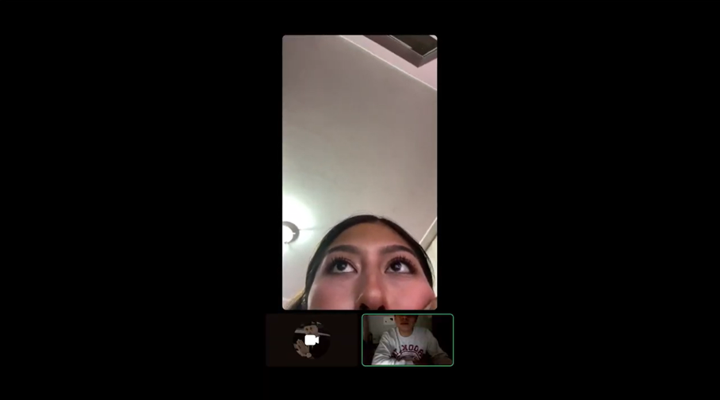

### Resumen
En la entrevista se presenta FlowQueue a una trabajadora administrativa de Talma Servicios Aeroportuarios. Ella explica que la atención se organiza por orden de llegada y, en algunos casos, con números manuales. El principal problema ocurre en horas pico, especialmente en la mañana y tarde, cuando las colas aumentan y los pasajeros esperan más de 30 minutos, generando quejas e incomodidad. Además, menciona que el personal tiene dificultades para manejar a los usuarios por falta de información clara sobre los tiempos de atención. Considera que una plataforma que gestione turnos en tiempo real ayudaría a organizar mejor las filas, informar a los pasajeros y asignar el personal necesario. 


**Entrevista 2 – Personal administrativo de atención**
| Campo | Detalle |
|------|--------|
| Entrevistado |  Eduardo Aguirre |
| Edad | 31 años |
| Distrito |  San Miguel |
| Duración | 4:31 |
| Tiempo de inicio | 00:00 |
| Link | [Ver entrevista](https://drive.google.com/file/d/17PgnA8MeDgaUX3k68Mo4J2JP2S1-qrt7/view?usp=drive_link) |


### Resumen
Eduardo Aguirre (31 años, San Miguel) es un técnico administrativo con una personalidad metódica pero estresada por el desorden ambiental. En su vida personal es un usuario tecnológico habitual de Android, Rappi y YouTube, lo que lo hace muy crítico con el sistema de su oficina, el cual considera obsoleto al funcionar sobre Windows y Microsoft Edge con tiqueteros de papel que fallan seguido. Su mayor frustración ocurre en la hora punta (10:30 AM a 1:30 PM), donde la aglomeración y el ruido lo obligan a actuar como controlador de multitudes en lugar de administrativo, afectando su salud mental. Eduardo considera que FlowQueue es una solución indispensable porque, al notificar al usuario en tiempo real, limpiaría la sala de espera física, permitiéndole trabajar en silencio, con mayor seguridad y enfocado únicamente en la gestión del trámite.

**Entrevista 1 -  Responsables o supervisores de sede**
| Campo | Detalle |
|------|--------|
| Entrevistado |  Eduardo Villanueva|
| Edad | 21 años |
| Distrito |  Santiago de Surco |
| Duración | 4:31 |
| Tiempo de inicio | 00:00 |
| Link | [Ver entrevista](https://drive.google.com/file/d/17PgnA8MeDgaUX3k68Mo4J2JP2S1-qrt7/view?usp=drive_link) |


### Resumen
Eduardo Villanueva (25 años, Surco) es un Jefe de Operaciones con un perfil ejecutivo y orientado a resultados. Como usuario de tecnología de alta gama (Apple), valoro la inmediatez y el orden, lo cual contrasta con la realidad de su sede, donde la medición de eficiencia es manual y arcaica. Su principal frustración es la falta de datos precisos para reducir la Tasa de Abandono y el Tiempo de Espera. Javier ve en FlowQueue una oportunidad estratégica de transformación digital para descongestionar las salas físicas y proyectar una imagen de "Smart City", permitiéndole gestionar la sede mediante indicadores reales y no solo por volumen de tickets al final del día. 

### 2.3. NeedFinding
Como resultado del análisis de entrevistas realizadas a potenciales usuarios y del estudio de plataformas similares en el mercado, se han identificado dos segmentos objetivos clave para la propuesta de valor de la startup FlowQueue
#### 2.3.1. User Personas
**Segmento 1: El ciudadano con tiempo limitado**

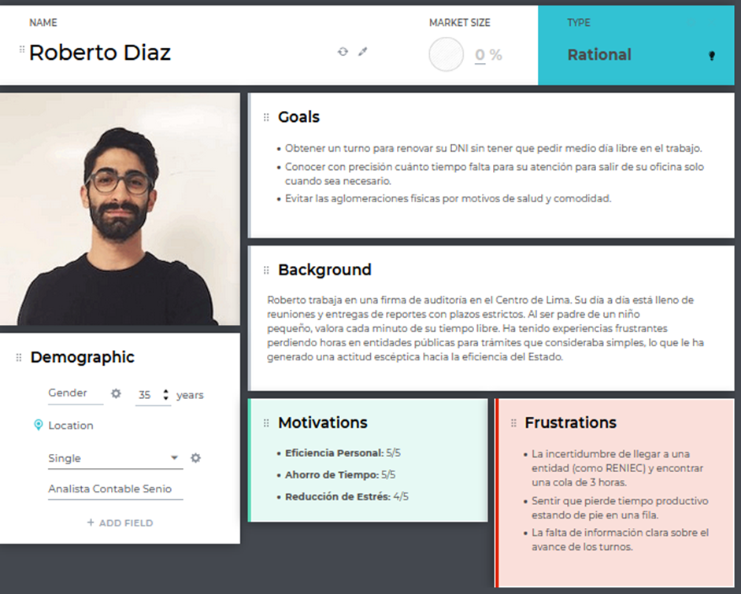

**Segmento 2: El operador de atención al ciudadano**

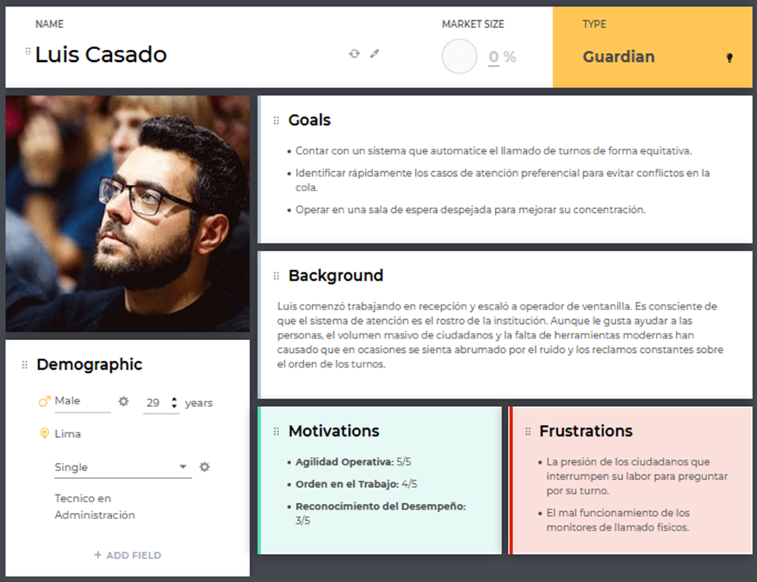

**Segmento 3: El responsable de gestión de sede**

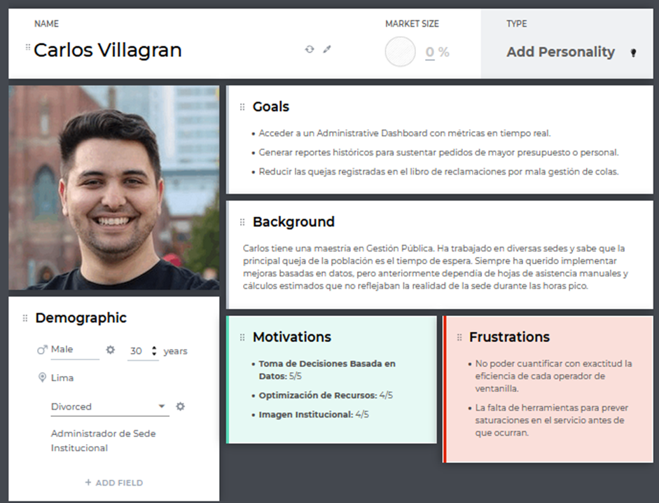
## 2.3.2. User Task Matrix

### User Task Matrix – Citizen

| Tarea del usuario | Frecuencia | Importancia |
|-------------------|-----------|-------------|
| Consultar disponibilidad de atención | Alta | Alta |
| Obtener un turno | Alta | Alta |
| Ver posición en la cola | Alta | Alta |
| Recibir notificaciones de atención | Media | Alta |
| Reprogramar o cancelar turno | Media | Media |
| Estimar tiempo de espera | Alta | Alta |
| Evitar desplazamiento innecesario | Alta | Alta |
| Validar requisitos del trámite | Media | Alta |
| Acceder a información del trámite | Media | Alta |

### User Task Matrix – Counter Operator

| Tarea del usuario | Frecuencia | Importancia |
|-------------------|-----------|-------------|
| Registrar usuarios en cola | Alta | Alta |
| Visualizar cola en tiempo real | Alta | Alta |
| Llamar al siguiente usuario | Alta | Alta |
| Priorizar casos especiales | Media | Alta |
| Reorganizar turnos | Media | Alta |
| Controlar flujo de atención | Alta | Alta |
| Comunicar incidencias | Media | Media |
| Gestionar usuarios ausentes | Media | Media |
| Validar asistencia del usuario | Alta | Alta |

### User Task Matrix – Supervisor

| Tarea del usuario | Frecuencia | Importancia |
|-------------------|-----------|-------------|
| Monitorear tiempos de espera | Alta | Alta |
| Identificar horas pico | Media | Alta |
| Evaluar desempeño del personal | Media | Alta |
| Tomar decisiones operativas | Media | Alta |
| Supervisar múltiples colas | Alta | Alta |
| Generar reportes | Media | Media |
| Detectar cuellos de botella | Media | Alta |
| Optimizar asignación de recursos | Media | Alta |
| Analizar satisfacción del usuario | Baja | Media |#### 2.3.3. User Journey Mapping

#### 2.3.3. User Journey Mapping

**Segmento 1: El ciudadano con tiempo limitado**

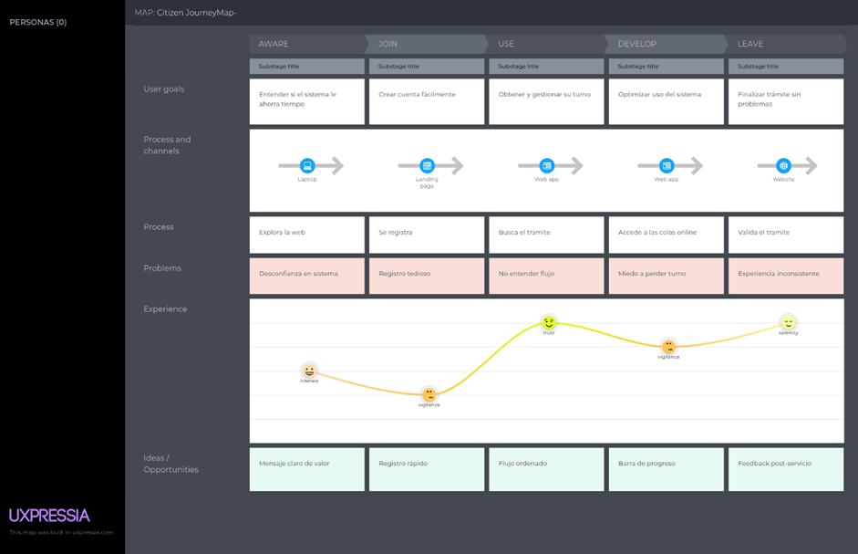

**Segmento 2: El operador de atención al ciudadano**

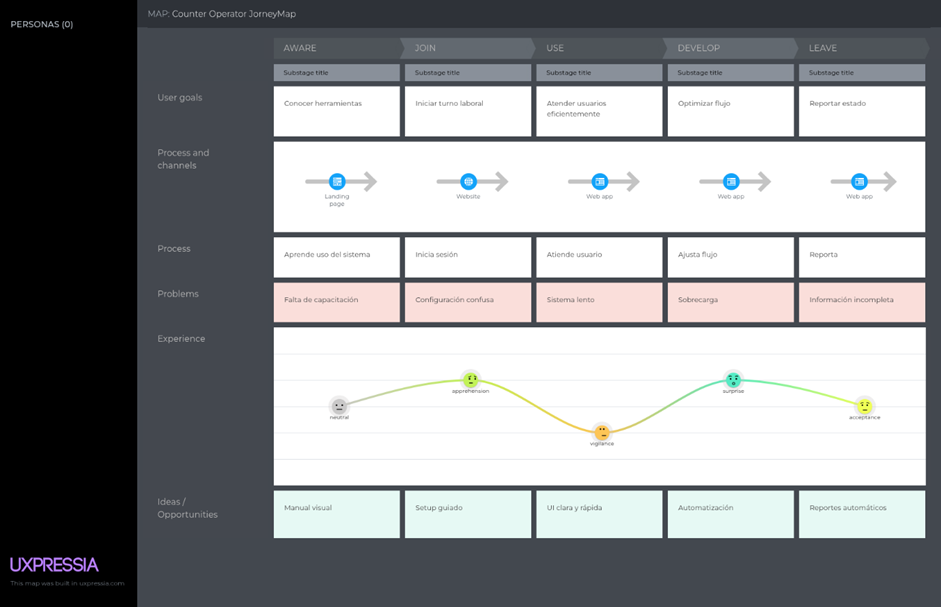

**Segmento 3: El responsable de gestión de sede**

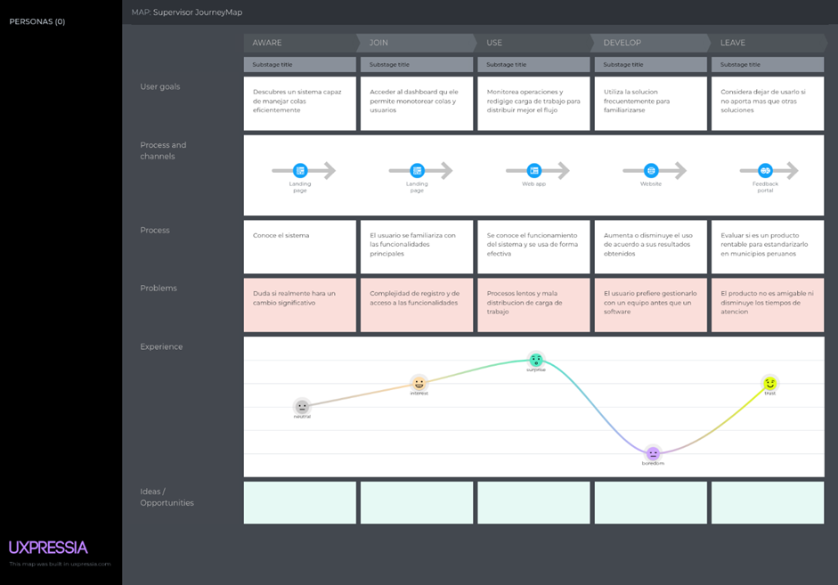

#### 2.3.4. Empathy Mapping

**Segmento 1: El ciudadano con tiempo limitado**

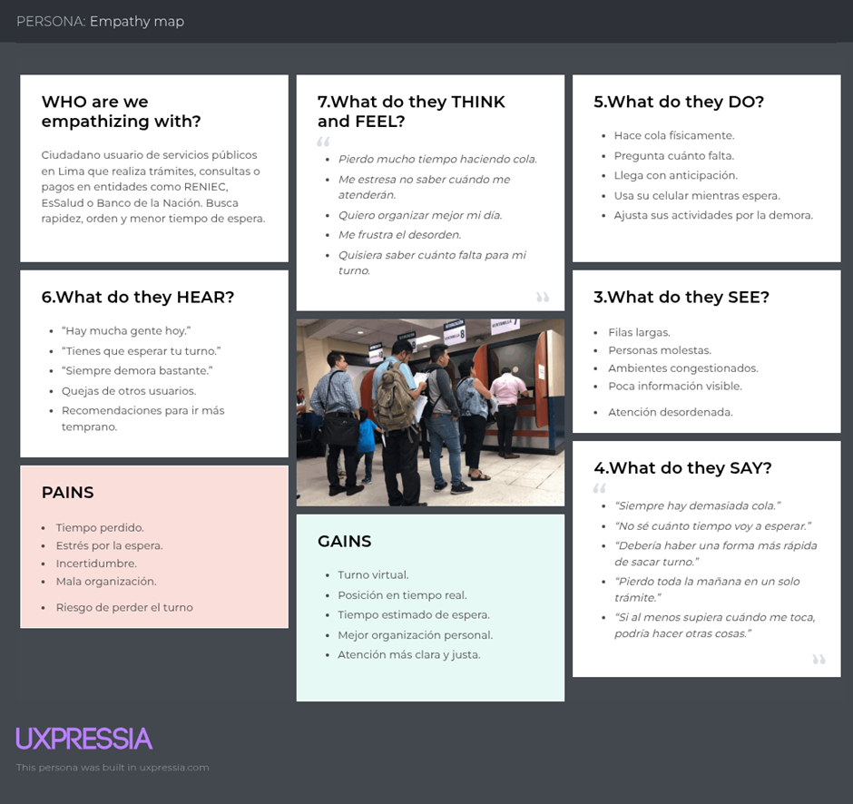

**Segmento 2: El operador de atención al ciudadano**

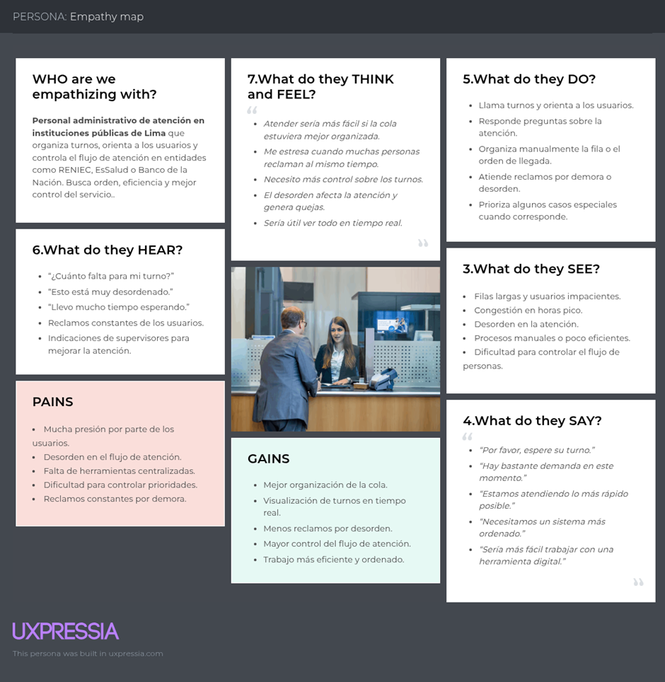

**Segmento 3: El responsable de gestión de sede**

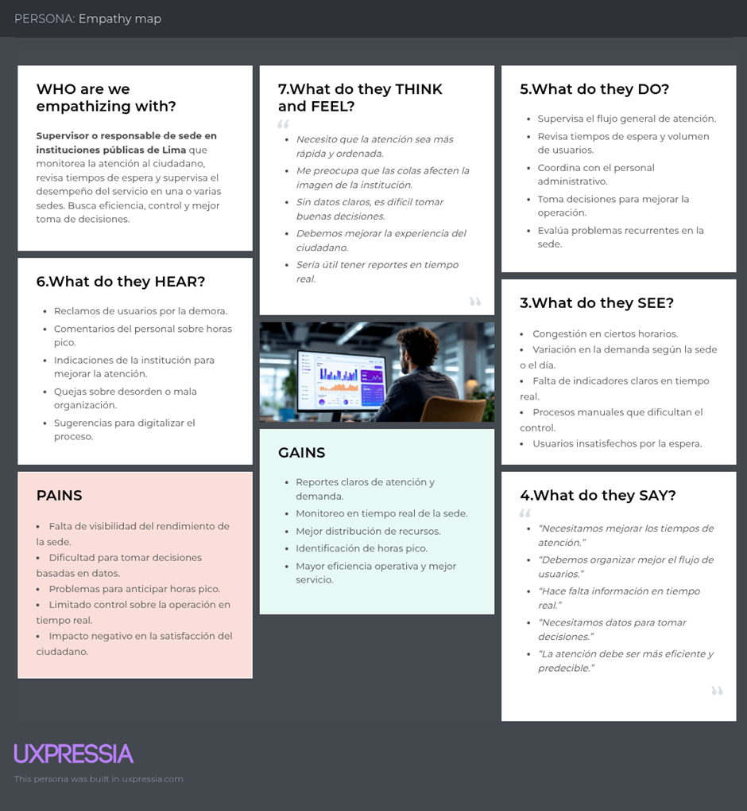


### 2.4. Big Picture EventStorming


## 2.5. Ubiquitous Language

En esta sección se definen los términos clave del dominio de **FlowQueue**. Estos términos son de uso obligatorio para el equipo de desarrollo, los interesados y los usuarios finales, garantizando una comunicación sin ambigüedades.

---

**Administrative Dashboard**  
Interfaz de gestión centralizada donde el *Headquarters Supervisor* visualiza indicadores de rendimiento, métricas de atención y supervisa el estado operativo de las sedes.

**Citizen**  
Usuario final que accede a la plataforma para buscar instituciones, emitir un *Digital Ticket* y realizar el seguimiento de su turno de forma remota.

**Counter Operator**  
Personal de la institución encargado de gestionar el flujo de la *Virtual Queue* desde un *Service Counter*, realizando llamados y finalizando atenciones.

**Digital Ticket**  
Identificador único generado por el sistema que representa el turno del *Citizen*. Incluye código de turno, hora de emisión y un código QR para validación.

**Headquarters Supervisor**  
Rol administrativo responsable de monitorear la eficiencia de la sede y tomar decisiones basadas en analítica de datos.

**Queue Status**  
Información dinámica que indica la posición del usuario en la fila, el número de turnos restantes y el estado actual de la atención en sala.

**Real-Time Update**  
Mecanismo de sincronización que asegura que los cambios en la *Virtual Queue* se reflejen instantáneamente en todos los dispositivos conectados.

**Service Counter**  
Punto de atención físico (ventanilla) asignado a un *Counter Operator* para realizar el trámite solicitado por el *Citizen*.

**Service Type**  
Categorización de trámites que define a qué flujo o *Virtual Queue* específico ingresará el usuario.

**Virtual Queue**  
Estructura lógica y digital que organiza el orden de llegada de los usuarios, eliminando la necesidad de una fila física en la sede.

**Waiting Time Estimate**  
Tiempo aproximado de espera calculado mediante algoritmos que consideran el ritmo de atención actual de los *Counter Operators*.

## Capítulo III: Requirements Specification

## 3.1. User Stories

| Epic / Story ID | Título | Descripción | Criterios de Aceptación | Relacionado con (Epic ID) |
|----------------|--------|-------------|------------------------|--------------------------|
| EP-01 | Landing Page | N/A | N/A | N/A |
| HU-01 | Propuesta de valor | Como visitante, quiero entender el propósito de la plataforma, para conocer sus beneficios. | Dado que accede a la web, cuando ve el hero, entonces se muestra el mensaje principal. | EP-01 |
| HU-02 | Beneficios | Como visitante, quiero ver beneficios, para evaluar el servicio. | Dado que navega la página, cuando llega a beneficios, entonces se muestran ventajas por rol. | EP-01 |
| HU-03 | Flujo del sistema | Como visitante, quiero entender cómo funciona, para saber cómo usarlo. | Dado que revisa información, cuando ve el flujo, entonces comprende el proceso. | EP-01 |
| HU-26 | Recuperar contraseña | Como citizen, quiero recuperar mi cuenta, para volver a acceder. | Dado que olvidó contraseña, cuando ingresa correo, entonces recibe enlace. | EP-01 |
| HU-27 | Responsive | Como visitante, quiero usar cualquier dispositivo, para acceder fácilmente. | Dado que entra desde el móvil, cuando carga la web, entonces se adapta. | EP-01 |
| HU-28 | CTA | Como visitante, quiero botones claros, para registrarme rápido. | Dado que está en landing, cuando ve CTA, entonces navega a registro. | EP-01 |
| EP-02 | Citizen Experience | N/A | N/A | N/A |
| HU-04 | Registro | Como citizen, quiero registrarme, para acceder al sistema. | Dado que no tiene cuenta, cuando ingresa datos, entonces se crea perfil. | EP-02 |
| HU-05 | Login | Como citizen, quiero iniciar sesión, para acceder a mis turnos. | Dado que está registrado, cuando ingresa credenciales, entonces accede. | EP-02 |
| HU-06 | Buscar entidades | Como citizen, quiero filtrar entidades, para encontrar servicios. | Dado que usa buscador, cuando filtra, entonces muestra resultados. | EP-02 |
| HU-07 | Seleccionar sede | Como citizen, quiero elegir sede, para atenderme ahí. | Dado que selecciona entidad, cuando ve sedes, entonces elige una. | EP-02 |
| HU-08 | Seleccionar trámite | Como citizen, quiero elegir servicio, para obtener el turno correcto. | Dado que elige sede, cuando selecciona el trámite, entonces continúa. | EP-02 |
| HU-09 | Generar ticket | Como citizen, quiero ticket digital, para evitar filas. | Dado que confirma servicio, cuando genera ticket, entonces crea QR. | EP-02 |
| HU-10 | Ver posición | Como citizen, quiero ver mi posición, para estimar espera. | Dado que tiene ticket, cuando consulta, entonces se actualiza. | EP-02 |
| HU-11 | Tiempo estimado | Como citizen, quiero ver tiempo para organizarme. | Dado que tiene ticket, cuando el sistema calcula, entonces muestra tiempo. | EP-02 |
| HU-12 | Notificación turno | Como citizen, quiero alertas, para no perder turno. | Dado que el turno está cerca, cuando faltan pocos, entonces notifica. | EP-02 |
| HU-13 | Estado turno | Como citizen, quiero ver el estado, para saber la situación. | Dado que consulta ticket, cuando el sistema responde, entonces muestra estado. | EP-02 |
| HU-14 | Cancelar turno | Como citizen, quiero cancelar turno, para liberar espacio. | Dado que tiene turno, cuando cancela, entonces elimina. | EP-02 |
| HU-15 | Historial | Como citizen, quiero ver historial, para registrar trámites. | Dado que entra perfil, cuando ve historial, entonces lista registros. | EP-02 |
| HU-29 | Reprogramar | Como citizen, quiero cambiar turno, para otro horario. | Dado que tiene turno, cuando reprograma, entonces elige nuevo. | EP-02 |
| HU-30 | Personas delante | Como citizen, quiero ver cuántos hay antes, para estimar mejor. | Dado que consulta ticket, cuando el sistema responde, entonces muestra el número. | EP-02 |
| HU-31 | Retrasos | Como citizen, quiero saber los retrasos, para ajustar el tiempo. | Dado que hay demora, cuando el sistema detecta, entonces notifica. | EP-02 |
| EP-03 | Counter Management | N/A | N/A | N/A |
| HU-16 | Seleccionar ventanilla | Como operador, quiero elegir ventanilla, para atender correctamente. | Dado que inicia sesión, cuando selecciona, entonces queda activo. | EP-03 |
| HU-17 | Llamar turno | Como operador, quiero llamar al siguiente, para mantener el orden. | Dado que hay cola, cuando llama, entonces asigna turno. | EP-03 |
| HU-18 | Mostrar en pantalla | Como operador, quiero mostrar ticket, para guiar al usuario. | Dado que llama turno, cuando el sistema procesa, entonces muestra en pantalla. | EP-03 |
| HU-19 | Prioridad | Como operador, quiero dar prioridad, para casos especiales. | Dado que hay prioridad, cuando edita, entonces sube en cola. | EP-03 |
| HU-20 | Finalizar atención | Como operador, quiero cerrar turno, para liberar ventanilla. | Dado que termina atención, cuando confirma, entonces se completa. | EP-03 |
| HU-32 | Marcar ausente | Como operador, quiero marcar ausencia, para continuar el flujo. | Dado que no responde, cuando marca, entonces se omite. | EP-03 |
| HU-33 | Pausar atención | Como operador, quiero pausar, para detener flujo. | Dado que ocurre pausa, cuando activa, entonces se detiene. | EP-03 |
| HU-34 | Reanudar | Como operador, quiero reanudar, para continuar el flujo. | Dado que estaba pausado, cuando reanuda, entonces continúa. | EP-03 |
| HU-35 | Filtrar turnos | Como operador, quiero filtrar, para ver específicos. | Dado que aplica filtro, cuando ejecuta, entonces muestra resultados. | EP-03 |
| EP-04 | Administración | N/A | N/A | N/A |
| HU-21 | Dashboard | Como admin, quiero ver métricas, para monitorear. | Dado que accede, cuando carga, entonces muestra datos. | EP-04 |
| HU-22 | Métricas espera | Como admin, quiero analizar tiempos, para mejorar servicio. | Dado que filtra fechas, cuando consulta, entonces muestra gráfico. | EP-04 |
| HU-23 | Desempeño | Como admin, quiero ver productividad, para optimizar recursos. | Dado que consulta, cuando revisa, entonces muestra datos. | EP-04 |
| HU-36 | Crear sede | Como admin, quiero crear sedes, para expandir servicio. | Dado que ingresa datos, cuando guarda, entonces crea sede. | EP-04 |
| HU-37 | Crear servicios | Como admin, quiero definir trámites, para gestionar atención. | Dado que crea servicio, cuando guarda, entonces aparece. | EP-04 |
| HU-38 | Asignar operadores | Como admin, quiero asignar personal, para operar sedes. | Dado que selecciona operador, cuando asigna, entonces vincula. | EP-04 |
| HU-39 | Reportes | Como admin, quiero reportes, para analizar datos. | Dado que consulta, cuando selecciona periodo, entonces genera informe. | EP-04 |
| HU-40 | Comparar sedes | Como admin, quiero comparar, para evaluar rendimiento. | Dado que selecciona sedes, cuando compara, entonces muestra diferencias. | EP-04 |
| EP-05 | Technical | N/A | N/A | N/A |
| HU-24 | WebSockets | Como dev, quiero tiempo real, para actualizar datos. | Dado que hay cambios, cuando ocurren, entonces se reflejan. | EP-05 |
| HU-25 | Notificaciones | Como dev, quiero alertas push, para avisar turnos. | Dado que evento ocurre, cuando se dispara, entonces envía notificación. | EP-05 |
| HU-41 | Seguridad | Como sistema, quiero proteger datos, para evitar accesos indebidos. | Dado que hay login, cuando valida, entonces autentica. | EP-05 |
| HU-42 | Escalabilidad | Como sistema, quiero soportar usuarios, para no fallar. | Dado que hay alta carga, cuando escala, entonces responde bien. | EP-05 |
| HU-43 | Disponibilidad | Como sistema, quiero estar activo, para ser accesible. | Dado que sistema opera, cuando usuario accede, entonces responde. | EP-05 |
| HU-44 | Backup | Como sistema, quiero respaldo, para evitar pérdida. | Dado que ocurre fallo, cuando recupera, entonces restaura datos. | EP-05 |
| HU-45 | Logs | Como dev, quiero registrar eventos, para monitorear. | Dado que ocurre evento, cuando se ejecuta, entonces guarda log. | EP-05 |
| HU-46 | API REST | Como dev, quiero endpoints, para comunicación. | Dado que cliente solicita, cuando API responde, entonces entrega datos. | EP-05 |
| HU-47 | Actualización automática | Como usuario, quiero ver datos en tiempo real, para no recargar la página. | Dado que el usuario tiene un ticket activo, cuando cambia la cola, entonces la interfaz se actualiza automáticamente. | EP-05 |
| HU-48 | Multidispositivo | Como usuario, quiero usar el sistema en distintos dispositivos, para tener flexibilidad de acceso. | Dado que el usuario cambia de dispositivo, cuando inicia sesión, entonces puede continuar su sesión sin problemas. | EP-05 |
| HU-49 | Accesibilidad | Como usuario, quiero una interfaz accesible, para poder usarla sin dificultad. | Dado que el usuario accede al sistema, cuando navega la interfaz, entonces cumple criterios básicos de accesibilidad. | EP-05 |
| HU-50 | Onboarding inicial | Como usuario, quiero una guía inicial, para entender cómo usar la plataforma. | Dado que el usuario ingresa por primera vez, cuando accede al sistema, entonces se muestra una guía paso a paso. | EP-05 |

### 3.2. Impact Mapping

**Roberto (Citizen)**
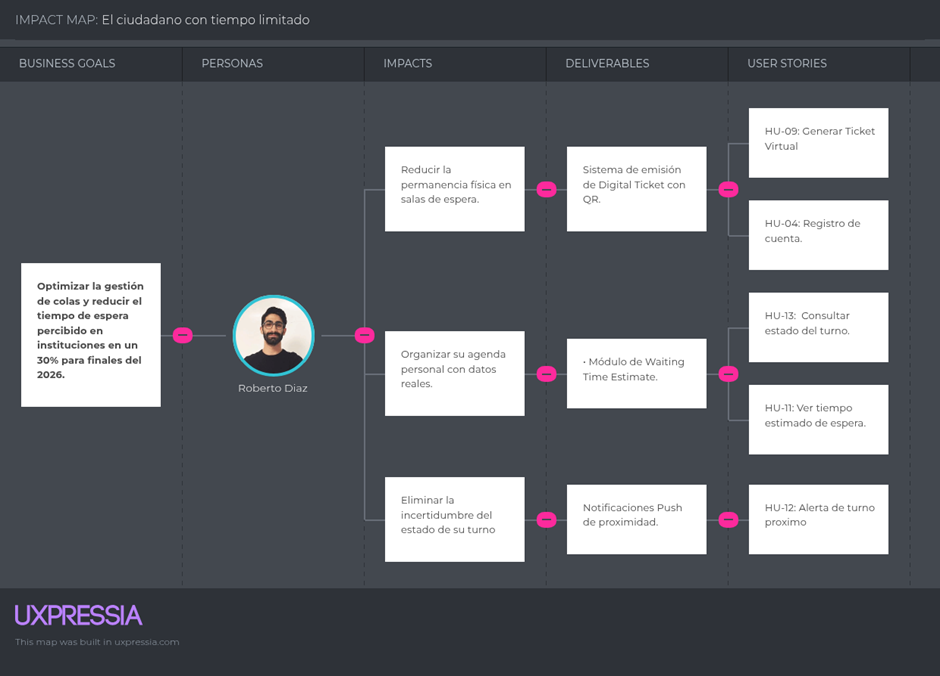

**Luis (Counter Operator)**

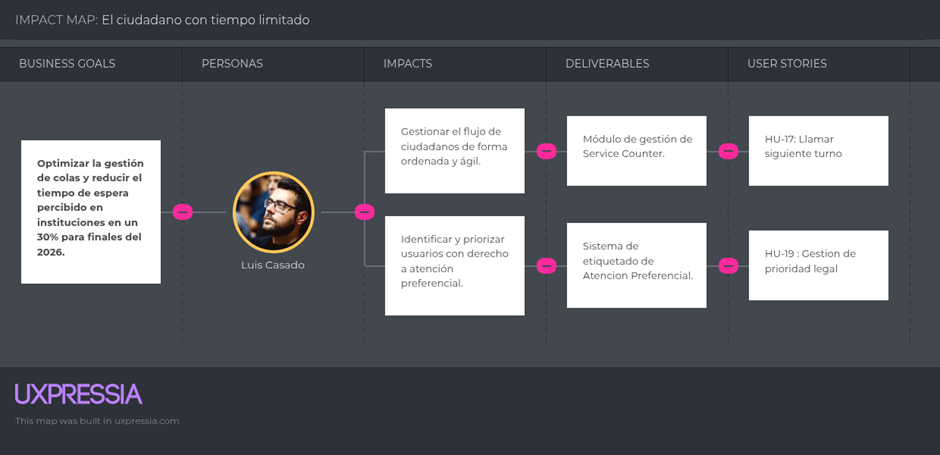

**Carlos (Headquarters Supervisor)**

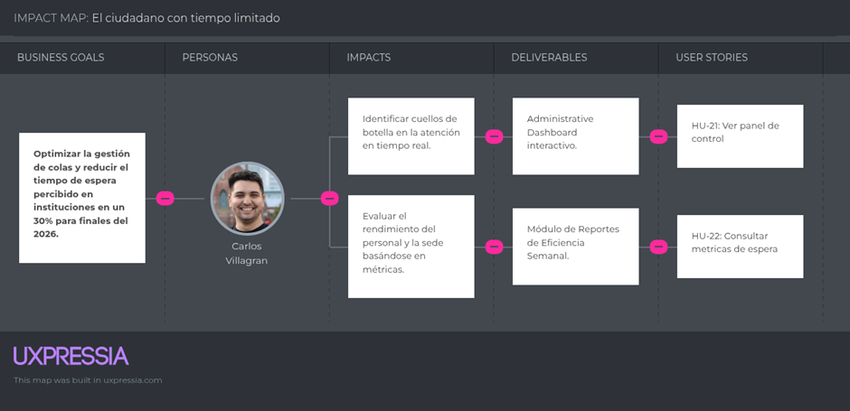


## 3.3. Product Backlog

| # Orden | User Story ID | Título | Descripción | Story Points |
|---------|--------------|--------|-------------|-------------|
| 1 | HU-01 | Visualizar propuesta de valor | Como visitante, quiero ver la misión de FlowQueue para entender cómo la plataforma optimiza mi tiempo de atención. | 2 |
| 2 | HU-02 | Sección de beneficios | Como visitante, quiero visualizar los beneficios por rol para evaluar la conveniencia del servicio. | 2 |
| 3 | HU-03 | Guía de funcionamiento | Como visitante, quiero ver un flujo de pasos para comprender el proceso de obtención de un turno digital. | 3 |
| 4 | HU-27 | Navegación responsive | Como visitante, quiero usar la plataforma en cualquier dispositivo para acceder fácilmente. | 2 |
| 5 | HU-28 | Call to Action | Como visitante, quiero acceder rápidamente al registro o login. | 2 |
| 6 | HU-04 | Registrarse en la plataforma | Como citizen, quiero registrarme para acceder a los servicios. | 3 |
| 7 | HU-05 | Iniciar sesión | Como citizen, quiero iniciar sesión para acceder a mis turnos. | 2 |
| 8 | HU-26 | Recuperar contraseña | Como citizen, quiero recuperar mi cuenta en caso de olvido. | 2 |
| 9 | HU-06 | Búsqueda de entidades | Como citizen, quiero filtrar instituciones para encontrar dónde hacer mi trámite. | 3 |
| 10 | HU-07 | Seleccionar sede | Como citizen, quiero elegir la sede donde seré atendido. | 3 |
| 11 | HU-08 | Seleccionar trámite | Como citizen, quiero elegir el servicio que necesito. | 3 |
| 12 | HU-09 | Generar ticket virtual | Como citizen, quiero obtener un ticket virtual para evitar filas. | 5 |
| 13 | HU-13 | Consultar estado del turno | Como citizen, quiero consultar el estado de mi turno. | 3 |
| 14 | HU-10 | Visualizar posición en la cola | Como citizen, quiero ver mi posición en la cola. | 5 |
| 15 | HU-11 | Ver tiempo estimado | Como citizen, quiero visualizar el tiempo de espera. | 5 |
| 16 | HU-30 | Ver personas delante | Como citizen, quiero saber cuántos hay antes que yo. | 3 |
| 17 | HU-12 | Recibir notificaciones | Como citizen, quiero recibir alertas de turno. | 3 |
| 18 | HU-31 | Notificación de retraso | Como citizen, quiero saber si hay retrasos. | 2 |
| 19 | HU-14 | Cancelación de ticket | Como citizen, quiero cancelar mi turno si no asistiré. | 2 |
| 20 | HU-29 | Reprogramar turno | Como citizen, quiero cambiar mi turno. | 3 |
| 21 | HU-15 | Historial de trámites | Como citizen, quiero ver mis atenciones pasadas. | 2 |
| 22 | HU-16 | Selección de ventanilla | Como operador, quiero elegir mi ventanilla de trabajo. | 2 |
| 23 | HU-17 | Llamar siguiente turno | Como operador, quiero llamar al siguiente usuario. | 5 |
| 24 | HU-18 | Visualizar cola en tiempo real | Como operador, quiero ver la cola actualizada. | 5 |
| 25 | HU-19 | Marcar turno atendido | Como operador, quiero marcar un turno como atendido. | 3 |
| 26 | HU-20 | Gestionar prioridad | Como operador, quiero priorizar ciertos casos. | 5 |
| 27 | HU-32 | Marcar ausente | Como operador, quiero registrar usuarios ausentes. | 3 |
| 28 | HU-33 | Pausar atención | Como operador, quiero pausar la cola. | 2 |
| 29 | HU-34 | Reanudar atención | Como operador, quiero reanudar la atención. | 2 |
| 30 | HU-35 | Filtrar turnos | Como operador, quiero filtrar la cola. | 3 |
| 31 | HU-21 | Visualizar dashboard | Como supervisor, quiero ver métricas generales. | 5 |
| 32 | HU-22 | Analizar tiempos | Como supervisor, quiero analizar tiempos de espera. | 5 |
| 33 | HU-25 | Identificar horas pico | Como supervisor, quiero identificar picos de demanda. | 3 |
| 34 | HU-23 | Evaluar desempeño | Como supervisor, quiero ver rendimiento de operadores. | 3 |
| 35 | HU-39 | Generar reportes | Como supervisor, quiero generar reportes. | 3 |
| 36 | HU-40 | Comparar sedes | Como supervisor, quiero comparar rendimiento. | 3 |
| 37 | HU-36 | Crear sede | Como administrador, quiero registrar sedes. | 3 |
| 38 | HU-37 | Crear servicios | Como administrador, quiero definir trámites. | 3 |
| 39 | HU-38 | Asignar operadores | Como administrador, quiero asignar personal. | 3 |
| 40 | HU-24 | WebSockets | Como developer, quiero actualizar datos en tiempo real. | 5 |
| 41 | HU-41 | Seguridad | Como sistema, quiero proteger los datos. | 5 |
| 42 | HU-42 | Escalabilidad | Como sistema, quiero soportar alta demanda. | 5 |
| 43 | HU-43 | Disponibilidad | Como sistema, quiero estar disponible siempre. | 5 |
| 44 | HU-44 | Backup | Como sistema, quiero respaldar información. | 3 |
| 45 | HU-45 | Logs | Como sistema, quiero registrar eventos. | 3 |
| 46 | HU-46 | API REST | Como sistema, quiero exponer servicios. | 5 |
| 47 | HU-47 | Actualización automática | Como usuario, quiero ver cambios sin recargar. | 5 |
| 48 | HU-48 | Multidispositivo | Como usuario, quiero usar varios dispositivos. | 3 |
| 49 | HU-49 | Accesibilidad | Como usuario, quiero una interfaz fácil de usar. | 3 |
| 50 | HU-50 | Onboarding | Como usuario, quiero una guía inicial. | 2 |
## Capítulo IV: Product Design

### 4.1. Style Guidelines
### 4.1.1 General Style Guidelines

#### Branding

FlowQueue es una plataforma institucional peruana orientada a la digitalización de servicios públicos. Su identidad visual debe transmitir confianza, modernidad y accesibilidad, evitando una estética fría o corporativa excesiva. El nombre **“Flow”** inspira fluidez y movimiento, mientras que **“Queue”** refuerza el concepto de orden y gestión.

| Dimensión | Posición |
|---|---|
| Divertido / Serio | Moderadamente serio |
| Formal / Casual | Semi-formal |
| Respetuoso / Irreverente | Respetuoso |
| Entusiasta / Sereno | Ligeramente entusiasta |

Este tono se refleja en frases como **“Di adiós a las filas interminables”**, usada en el hero de la landing, ya que es directa y motivadora sin resultar informal.

#### Colores

| Color | Nombre | Uso | Significado |
|---|---|---|---|
| `#0C447C` | Deep Blue | `.navbar`, `.home-section` | Transmite institucionalidad, seriedad y confianza. Es ideal para entidades públicas. |
| `#22c55e` | Action Green | `.solicitar-btn`, `.texto-Queue` | Representa fluidez, avance y acción. Es el color principal de llamada a la acción. |
| `#5DCAA5` | Soft Teal | `.segunda-linea` del `h1` | Funciona como acento visual, suaviza el contraste y aporta modernidad. |
| `#185FA5` | Institutional Blue | `.descripcion-lugar` | Diferencia visualmente las etiquetas informativas del fondo principal. |

#### Tipografía

En el código se usa `sans-serif` como familia base. Para producción, se recomienda utilizar **Inter**, debido a su alta legibilidad en interfaces digitales institucionales.

| Elemento | Tamaño | Peso | Uso |
|---|---:|---:|---|
| Hero `h1` | `2.5rem` | `700` | Título principal de la landing |
| Métricas | `1.5rem` | `700` | Números destacados |
| Cuerpo | `1rem` | `400` | Párrafos descriptivos |
| UI pequeño | `0.875rem` | `500 - 600` | Navbar, botones y etiquetas |

#### Espaciado

El sistema de espaciado sigue una escala basada en `rem` para garantizar consistencia responsive.

```css
/* Espaciados usados en el proyecto */

gap: 0.5rem;      /* Entre logo e ícono de marca */
gap: 1rem;        /* Entre botones en móvil */
gap: 1.5rem;      /* Entre links de navegación */
gap: 2rem;        /* Entre métricas destacadas */
gap: 2.5rem;      /* Entre elementos del container navbar */

padding: 0 2rem;        /* Navbar horizontal */
padding: 4rem 2rem;     /* Sección hero */
padding: 0.5rem 1.2rem; /* Botones */
```

### 4.4.2 Web Style Guidelines

#### Layout & Grid System

El sistema de layout define cómo se estructuran todas las pantallas del sistema, como landing, dashboards, paneles administrativos y vistas operativas.

##### Grid principal

| Elemento | Regla de diseño |
|---|---|
| Contenedores | Centrados con `max-width: 1200px - 1440px` |
| Margen lateral | Consistente con `padding: 0 2rem` |
| Organización | Secciones claras y jerarquizadas |
| Adaptabilidad | Diseño responsive para laptop, tablet y móvil |

#### Estructura por tipo de vista

| Vista | Estructura recomendada |
|---|---|
| Landing | Layout centrado con jerarquía vertical: `Hero → Features → CTA`. Uso de secciones con padding amplio entre `4rem` y `6rem`. |
| Dashboard / Paneles | Sidebar fija a la izquierda, contenido con scroll independiente y uso de `cards` para mostrar información. |
| Panel Operador | Layout principal horizontal, información crítica en la parte superior como el turno actual y tabla operativa disponible. |

#### Patrones de Interacción

Define cómo el usuario interactúa con el sistema de manera clara, consistente y predecible.

##### Estado de botones

Todos los botones deben considerar los siguientes estados:

| Estado | Comportamiento visual |
|---|---|
| Default | Estado normal del botón |
| Hover | Leve cambio de brillo o sombra |
| Active | Reducción de escala con `scale(0.98)` |
| Disabled | Opacidad reducida y sin interacción |

```css
button {
  transition: all 0.2s ease;
}

button:hover {
  filter: brightness(1.05);
  box-shadow: 0 2px 6px rgba(0, 0, 0, 0.12);
}

button:active {
  transform: scale(0.98);
}

button:disabled {
  opacity: 0.5;
  pointer-events: none;
}
```
### 4.2. Information Architecture
#### 4.2.1. Organization Systems

**Organization Scheme (Esquema de organización)**
**Temático / Funcional:**
La información de FlowQueue se organiza según las funciones principales de la plataforma y los perfiles de usuario que interactúan con el sistema.
- Landing Page: presenta la propuesta de valor, beneficios, funcionalidades, perfiles de usuario, métricas esperadas, acceso anticipado y datos del equipo.
- Gestión de ciudadanos: permite al usuario registrarse, iniciar sesión, buscar entidades públicas, seleccionar sede, elegir trámite y generar un ticket virtual.
- Gestión de turnos: permite visualizar la posición en cola, el tiempo estimado de espera, el estado del turno, notificaciones y cancelación del ticket.
- Gestión del operador: permite al personal administrativo seleccionar ventanilla, visualizar la cola en tiempo real, llamar al siguiente turno, priorizar casos y marcar usuarios como atendidos o ausentes.
- Gestión del supervisor: permite monitorear métricas generales, revisar horas pico, comparar sedes, gestionar servicios, administrar operadores y generar reportes.
- Soporte y contacto: permite solicitar acceso anticipado, registrar datos de contacto y consultar información institucional del proyecto.

**Organization Structure (Estructura de organización)**
- Jerárquica (Árbol):
 FlowQueue parte desde una Landing Page como punto principal de entrada. Desde ahí, el usuario puede acceder a secciones informativas o iniciar flujos específicos según su perfil: ciudadano, operador o supervisor.
- Lineal:
 Se aplica en procesos que deben seguir una secuencia clara. Por ejemplo, el ciudadano primero busca una entidad, luego selecciona una sede, elige un trámite, genera su ticket virtual y finalmente monitorea su turno en tiempo real.
- Matriz:
 Se aplica en módulos donde la información puede organizarse y filtrarse por diferentes criterios. Por ejemplo, las colas pueden filtrarse por estado del turno, prioridad, ventanilla, sede, tipo de trámite o fecha. Asimismo, los reportes pueden analizarse por sede, rango de fechas, horas pico o cantidad de usuarios atendidos.

**Organization System (Sistema de organización aplicado)**
**Global navigation (menú principal en el header):**
La navegación global permite acceder a las secciones principales de la Landing Page y orienta al usuario dentro del sitio.
- Home
- Funciones
- Cómo funciona
- Sedes
- Precios / Resultados esperados
- Sobre nosotros
- Contacto / Solicitar demo

**Local navigation (submenús dentro de cada sección):**
Dentro de cada módulo o perfil de usuario, la navegación local organiza las acciones específicas que se pueden realizar.
- **Ciudadano:** Registro, Login, Buscar entidad, Seleccionar sede, Seleccionar trámite, Generar ticket, Ver estado del turno, Cancelar turno, Historial.
- **Operador:** Seleccionar ventanilla, Ver cola, Llamar siguiente turno, Priorizar casos, Marcar atendido, Marcar ausente, Pausar o reanudar atención.
- **Supervisor:** Dashboard, Métricas, Horas pico, Gestión de sedes, Gestión de servicios, Gestión de operadores, Reportes y comparación de sedes.
- **Landing Page:** Beneficios, funcionalidades, perfiles de usuario, métricas, acceso anticipado y contacto.
- 
**Contextual navigation (botones de acción dentro de un flujo):**
FlowQueue utiliza botones y acciones contextuales para guiar al usuario en cada etapa del proceso.
- “Obtener mi turno ahora”
- “Ver cómo funciona”
- “Solicitar demo”
- “Buscar entidad”
- “Elegir sede”
- “Generar ticket virtual”
- “Ver mi turno”
- “Cancelar mi turno”
- “Llamar siguiente turno”
- “Priorizar”
- “Marcar como atendido”
- “Generar reporte”
- “Enviar”

**Sistema aplicado en FlowQueue:**
El sistema de organización de FlowQueue combina una estructura jerárquica para la navegación general, una estructura lineal para los procesos principales del ciudadano y una estructura matricial para los módulos administrativos y de reportes. Esta combinación permite que cada usuario encuentre rápidamente la información o función que necesita, manteniendo una experiencia clara, ordenada y coherente con los flujos definidos en el proyecto.


### 4.2.2 Labeling Systems

El sistema de etiquetado de **FlowQueue** se basa en el principio de mínima fricción cognitiva: cada etiqueta debe comunicar su función con el menor número de palabras posible, siendo comprensible tanto para ciudadanos con poca experiencia digital como para personal administrativo.

#### Navegación Principal — Navbar

Como se implementó en `Navbar.vue`, las etiquetas del menú fueron simplificadas al máximo.

| Etiqueta usada | Alternativa descartada | Razón |
|---|---|---|
| Funciones | Funcionalidades del sistema | Demasiado técnico |
| Cómo funciona | Guía de uso de la plataforma | Muy largo |
| Sedes | Ubicaciones disponibles | Innecesariamente largo |
| Precios | Planes y tarifas | Más directo con una sola palabra |
| Sobre nosotros | Información del equipo | Menos natural |
| Solicitar demo | Solicitar una demostración | Se acorta sin perder significado |

#### Sección Hero — Home

Las etiquetas informativas de la landing siguen el mismo criterio de claridad, brevedad y orientación a la acción.

| Elemento | Etiqueta | Criterio |
|---|---|---|
| Badge de estado | Plataforma activa en Lima, Perú | Breve, con indicador visual de estado |
| Título principal | Di adiós a las filas interminables | Directo y orientado al problema |
| CTA principal | Obtener mi turno ahora | Acción clara en primera persona |
| CTA secundario | Ver cómo funciona | Orientado a exploración |

#### Métricas destacadas

| Número | Etiqueta | Cantidad de palabras |
|---|---|---:|
| 30% | Menos espera | 2 |
| +5k | Turnos gestionados | 2 |
| 3 | Instituciones piloto | 2 |
| 87% | Satisfacción | 1 |

#### Estados de turno

Para la gestión de tickets dentro de la plataforma, los estados se etiquetan con una sola palabra o frase breve acompañada de color.

| Estado | Etiqueta | Color asociado |
|---|---|---|
| Turno generado | Activo | Verde `#22c55e` |
| En espera | En cola | Azul `#0C447C` |
| Próximo a llamar | Próximo | Amarillo `#f59e0b` |
| Llamado | Llamado | Azul claro `#3b82f6` |
| Atendido | Completado | Gris `#6b7280` |
| No se presentó | Ausente | Rojo `#ef4444` |

#### Roles de usuario

| Rol técnico | Etiqueta en UI | Razón |
|---|---|---|
| `Citizen` | Ciudadano | Más cercano al usuario peruano |
| `Counter Operator` | Operador | Simple y directo |
| `Headquarters Supervisor` | Supervisor | Evita tecnicismos |
| `Admin` | Administrador | Familiar para todos |

#### Formularios y campos

| Campo | Etiqueta | Alternativa descartada |
|---|---|---|
| Email | Correo | Dirección de correo electrónico |
| Password | Contraseña | Clave de acceso |
| Nombre completo | Nombre | Nombres y apellidos completos |
| Sede | Sede | Ubicación de atención |
| Trámite | Trámite | Tipo de servicio requerido |

#### Criterios generales aplicados

| Criterio | Aplicación |
|---|---|
| Máximo 3 palabras | En navegación y botones |
| Máximo 2 palabras | En métricas y estados |
| Verbos en infinitivo | Obtener, Ver, Cancelar, Reprogramar |
| Sustantivos simples | Funciones, Sedes, Precios |
| Primera persona en CTAs | “Obtener mi turno” para generar cercanía |
| Sin tecnicismos visibles | El lenguaje debe ser claro para el usuario final |
### 4.2.3 SEO Tags and Meta Tags

En esta sección se definen los metadatos que serán utilizados en las principales páginas de la plataforma **FlowQueue**, tanto para la **Landing Page** como para la **Web Application**. Estos elementos permiten mejorar la visibilidad en motores de búsqueda y garantizar una correcta indexación del contenido.

#### Estructura Base HTML

A continuación, se presenta la estructura general de implementación de los meta tags dentro del documento HTML:

```html
<head>
  <meta charset="UTF-8">
  <meta name="viewport" content="width=device-width, initial-scale=1.0">

  <title>Título de la página</title>
  <meta name="description" content="Descripción de la página">
  <meta name="keywords" content="palabras clave">
  <meta name="author" content="autor del sitio">
</head>
```

### 4.2.4 Searching Systems

## Requerimientos funcionales

El sistema de búsqueda de **FlowQueue** permite localizar información de manera rápida tanto para ciudadanos como para operadores y supervisores.

| Requerimiento funcional | Descripción |
|---|---|
| Búsqueda por texto | Permite buscar entidades públicas, sedes, trámites, turnos digitales y reportes. |
| Autocomplete / sugerencias | Acelera la localización de instituciones, sedes o tipos de trámite. |
| Filtros avanzados | Filtrado por entidad, sede, servicio, estado, fecha, prioridad o ventanilla. |
| Búsqueda por ticket o QR | Validación rápida de turnos digitales mediante código o QR. |
| Búsqueda por estado de cola | Identificación de turnos en espera, llamados, atendidos, cancelados o ausentes. |
| Ordenamiento de resultados | Orden por fecha, prioridad, tiempo de espera, sede o relevancia. |
| Visualización de resultados | Resultados claros para identificación rápida de información. |
| Búsqueda combinada con filtros | Aplicable en tablas administrativas, dashboards y reportes. |
| Búsqueda por métricas | Consulta por rangos de fecha para análisis de desempeño. |
| Búsqueda multi-sede | Comparación de rendimiento entre diferentes oficinas. |

---

## Opciones de tecnología

### Comparativa de alternativas

| Tecnología | Pros | Contras |
|---|---|---|
| PostgreSQL Full-Text Search | Integrado con base de datos, simple, sin infraestructura adicional y suficiente para búsquedas del MVP | Menor flexibilidad para búsquedas avanzadas o gran escala |
| Elasticsearch / OpenSearch | Alto rendimiento, filtros avanzados, ranking y analítica potente | Requiere infraestructura adicional y mayor complejidad |
| Algolia (SaaS) | Muy rápida, autocomplete potente, tolerancia a errores tipográficos | Dependencia externa, costos y menor control |

---

## Tecnología seleccionada para el MVP

Para el MVP de **FlowQueue** se propone utilizar **PostgreSQL Full-Text Search**, debido a que permite implementar búsquedas internas de forma sencilla, integrada y suficiente para los módulos principales del sistema.

Esta alternativa resulta adecuada para una primera versión porque permite buscar:

- Entidades públicas  
- Sedes  
- Trámites  
- Tickets digitales  
- Colas virtuales  
- Reportes operativos  

Sin depender inicialmente de infraestructura externa.

En etapas futuras, si la plataforma crece en volumen de datos o requiere búsquedas más avanzadas, podría evaluarse incorporar **Elasticsearch** u **OpenSearch** para mejorar:

- Rendimiento  
- Relevancia de resultados  
- Analítica histórica  
- Escalabilidad  

---

## Esquema de índice

Ejemplo de índice para un motor tipo Elasticsearch / OpenSearch:

```json
{
 "mappings": {
   "properties": {
     "id": { "type": "keyword" },
     "ticket_code": { "type": "keyword" },
     "citizen_name": { "type": "text", "analyzer": "standard" },
     "institution_name": { "type": "text", "analyzer": "standard" },
     "branch_name": { "type": "text", "analyzer": "standard" },
     "service_type": { "type": "keyword" },
     "queue_status": { "type": "keyword" },
     "priority_level": { "type": "keyword" },
     "counter_number": { "type": "keyword" },
     "created_at": { "type": "date" },
     "estimated_waiting_time": { "type": "integer" }
   }
 }
}
```

---

## Campos principales del índice

| Campo | Descripción |
|---|---|
| `id` | Identificador único del registro |
| `ticket_code` | Código del ticket digital generado |
| `citizen_name` | Nombre del ciudadano asociado |
| `institution_name` | Entidad pública donde se realizará la atención |
| `branch_name` | Sede seleccionada |
| `service_type` | Tipo de trámite solicitado |
| `queue_status` | Estado actual del turno |
| `priority_level` | Nivel de prioridad del ticket |
| `counter_number` | Ventanilla asignada |
| `created_at` | Fecha y hora de generación |
| `estimated_waiting_time` | Tiempo estimado de espera |

---

## Ejemplos de búsqueda

### Búsqueda de ciudadano

**Buscar:**  
`RENIEC duplicado DNI`

**Filtros aplicados:**
- Distrito: Lima  
- Servicio: DNI  
- Estado de atención: Disponible

---

### Búsqueda de operador

**Buscar:**  
`FQ-2026-00125`

**Filtros aplicados:**
- Estado: En espera  
- Prioridad: Normal  
- Ventanilla: 3

---

### Búsqueda de supervisor

**Buscar:**  
`Tiempos de espera`

**Filtros aplicados:**
- Sede: Lima Norte  
- Fecha: Últimos 7 días  
- Horario: 08:00 – 12:00
  
### 4.2.5 Navigation Systems

El sistema de navegación de **FlowQueue** ha sido diseñado para proporcionar una experiencia intuitiva, eficiente y consistente para los distintos tipos de usuarios que interactúan con la plataforma.

Debido a que el sistema contempla tres perfiles principales:

- Ciudadanos  
- Operadores de atención  
- Supervisores / Administradores  

La navegación se organiza por módulos y flujos específicos para cada rol.

La estructura responde a principios de:

- Usabilidad  
- Mínima fricción cognitiva  
- Enfoque mobile-first  
- Consistencia entre vistas  
- Acceso rápido a funciones críticas  

Esto permite que los usuarios puedan desplazarse fácilmente entre pantallas, acceder rápidamente a funcionalidades clave y completar tareas sin complejidad innecesaria.

---


### 4.3. Landing Page UI Design
### 4.3.1 Landing Page Wireframe

Los wireframes de la **Landing Page de FlowQueue** representan la estructura visual base para **Desktop Web Browser** y **Mobile Web Browser**. Estas representaciones permiten validar la arquitectura de información, jerarquía visual y distribución de contenidos antes de aplicar estilos definitivos.

---

## Desktop Web Browser

El wireframe de escritorio está diseñado para una resolución base de **1280px**. La estructura sigue un flujo vertical descendente que guía al visitante desde el reconocimiento del problema hasta la conversión final.

| Sección | Descripción |
|---|---|
| Navbar | Barra de navegación fija en la parte superior. Incluye el logotipo FlowQueue a la izquierda, cinco enlaces centrados y el botón **Solicitar demo** destacado en verde a la derecha. |
| Hero Section | Sección principal de mayor jerarquía visual. Presenta la propuesta de valor, botones CTA, métricas y simulador de turno virtual. |
| Funcionalidades | Seis cards en grilla de tres columnas con iconografía simple y etiquetas cortas. |
| Cómo funciona | Proceso explicado en pasos numerados y conectados visualmente. |
| Perfiles | Tres cards horizontales diferenciadas por rol: ciudadano, operador y supervisor. |
| Impacto | Banda de contraste oscuro con métricas destacadas para reforzar credibilidad. |
| Sobre nosotros | Cuatro cards del equipo en grilla de cuatro columnas. |
| Footer CTA | Cierre con llamada a la acción final, campo de contacto y botón de conversión. |

---

## Mobile Web Browser

El wireframe mobile está adaptado a **375px de ancho**, siguiendo los breakpoints definidos en el código con `@media (max-width: 768px)`.

| Sección | Adaptación mobile |
|---|---|
| Navbar | El menú horizontal colapsa en menú hamburguesa. El botón **Solicitar demo** se traslada al menú desplegable. |
| Hero Section | El título reduce su tamaño de `2.5rem` a `1.8rem`. Los botones pasan a columna y ocupan el 100% del ancho. |
| Métricas | Las cuatro métricas se reorganizan en grilla `2x2`. |
| Funcionalidades | La grilla de tres columnas colapsa a una sola columna. |
| Perfiles | Las tres cards se apilan verticalmente. |
| Impacto | Se mantiene en columna única con mayor espaciado. |
| Footer CTA | Se adapta a columna única, manteniendo legibilidad y jerarquía. |

---

## Diseño inclusivo aplicado

| Criterio | Aplicación |
|---|---|
| Contraste | Textos sobre fondo `#0C447C` cumplen contraste mínimo WCAG AA. |
| Área táctil | Botones con área mínima de `44x44px`. |
| Etiquetas | Elementos interactivos con etiquetas descriptivas. |
| Tipografía | Tamaño mínimo de `0.875rem` para asegurar legibilidad. |
| Menú hamburguesa | Estado abierto/cerrado controlado por `ref` en Vue. |

---
#### 4.3.2. Landing Page Mock-up

### 4.4. Web Applications UX/UI Design
#### 4.4.1. Web Applications Wireframes
### 4.4.2 Web Applications Wireflow Diagrams

#### User Goal 1  
**Segmento:** Ciudadanos usuarios de servicios públicos  
**User Goal:** Obtener un turno virtual y monitorear su posición en la cola  

**Explicación:**  
El ciudadano busca evitar largas filas presenciales. A través de FlowQueue puede buscar la institución, seleccionar la sede y el trámite, generar su ticket digital y visualizar en tiempo real su posición en la cola y el tiempo estimado de atención, sin necesidad de estar físicamente presente.

---

#### User Goal 2  
**Segmento:** Personal administrativo de atención  
**User Goal:** Gestionar el flujo de turnos de forma eficiente desde el dashboard  

**Explicación:**  
El operador necesita mantener el orden de atención sin desorganización. FlowQueue le permite visualizar la cola en tiempo real, llamar al siguiente turno, priorizar casos especiales y marcar turnos como atendidos o ausentes desde una interfaz centralizada.

---

#### User Goal 3  
**Segmento:** Supervisores o responsables de sede  
**User Goal:** Monitorear el rendimiento de la atención y tomar decisiones operativas  

**Explicación:**  
El supervisor necesita evaluar la eficiencia del servicio. FlowQueue le proporciona un dashboard con métricas de tiempo de espera, volumen de usuarios, horas pico y desempeño por operador, permitiéndole tomar decisiones basadas en datos para optimizar los recursos de la sede.

### 4.4.3 Web Applications Mock-ups

En esta sección se presentan los diseños de alta fidelidad de la aplicación web **FlowQueue**. Estos mock-ups representan el estado final visual de la plataforma, integrando la paleta de colores institucional, la tipografía seleccionada y los componentes de interfaz definidos en las guías de estilo para asegurar una experiencia de usuario profesional y confiable.

#### 4.4.4. Web Applications User Flow Diagrams

### 4.5 Web Applications Prototyping

En esta sección se presentan los prototipos de interfaz web de **FlowQueue**, desarrollados para simular los principales flujos de interacción de la plataforma en navegador web. Los prototipos fueron diseñados considerando una arquitectura de información organizada por perfiles de usuario: ciudadano, operador de ventanilla y supervisor o administrador de sede.

Las decisiones de interacción se enfocan en facilitar una navegación clara, directa y orientada a tareas. Para el ciudadano, se prioriza la búsqueda de entidades, selección de sede, generación de ticket virtual y visualización de la posición en cola en tiempo real. Para el operador, se plantea una interfaz que permite seleccionar ventanilla, visualizar la cola, llamar al siguiente turno, priorizar casos y controlar el flujo de atención. Para el supervisor, se presenta un dashboard con métricas, análisis de horas pico, gestión de sedes y generación de reportes.

Los prototipos incluyen interacciones como botones de navegación, tarjetas seleccionables, formularios, filtros, estados visuales, notificaciones y transiciones entre pantallas. Estas decisiones están alineadas con los User Flow Diagrams y con las User Stories definidas para FlowQueue.

---

### 4.5.2 Mobile Web Browser Prototype

El prototipo mobile web browser representa la experiencia de **FlowQueue** adaptada a dispositivos móviles. Esta versión es importante porque el ciudadano utilizará principalmente su celular para obtener turnos, consultar su posición en cola y recibir notificaciones antes de acudir a una sede.

En esta versión se priorizan pantallas verticales, botones visibles, formularios simples, tarjetas apiladas y navegación directa. El flujo principal permite al usuario buscar una entidad pública, seleccionar sede y trámite, generar un ticket digital, visualizar su estado de atención y recibir alertas sobre su turno.

**Link del video:**  
https://1drv.ms/v/c/6463e088f0304028/IQCq8gBOgwtkQ6fONdbxlr2MAadxw0UsnvvyXu048hAwrlM?e=RE4nc5

### 4.6. Domain-Driven Software Architecture
#### 4.6.1. Domain-Level EventStorming
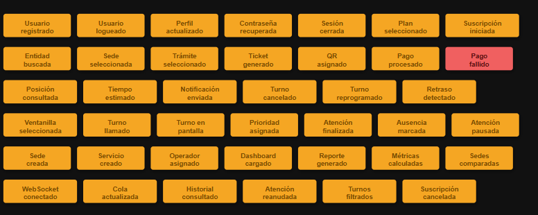


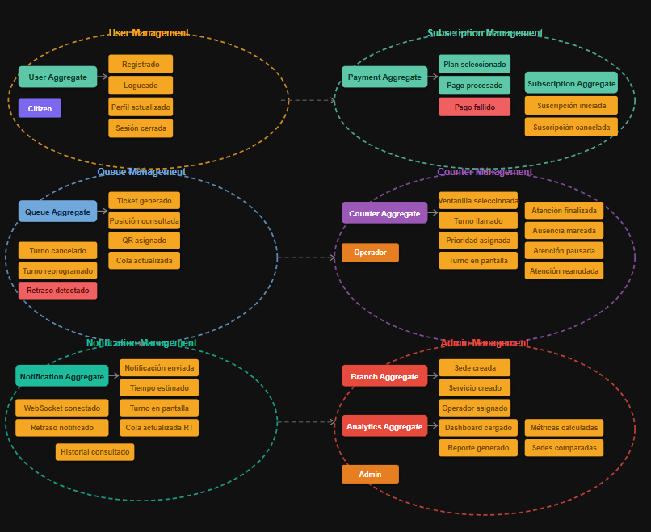
### 4.6.2 Software Architecture Context Diagram

El diagrama de contexto representa el nivel más alto de abstracción de la arquitectura de **FlowQueue**, siguiendo el modelo **C4**. En este nivel, el sistema se muestra como una única entidad central rodeada por los actores que interactúan con él y los sistemas externos con los que se comunica.

#### Actores del sistema

| Actor | Descripción |
|---|---|
| Ciudadano | Usuario final que accede a FlowQueue para obtener un turno virtual, consultar su posición en la cola y recibir notificaciones sobre su atención, todo desde cualquier dispositivo con acceso web. |
| Operador | Personal administrativo de la institución que gestiona el flujo de turnos desde su ventanilla, llamando al siguiente usuario y marcando atenciones como completadas o ausentes. |
| Supervisor | Responsable de sede que monitorea el rendimiento general, visualiza métricas en tiempo real y genera reportes para la toma de decisiones. |
| Administrador | Configura las sedes, servicios y operadores dentro de la plataforma, garantizando la correcta operación del sistema. |

#### Sistemas externos

| Sistema externo | Descripción |
|---|---|
| Servicio de notificaciones | Sistema de alertas que envía notificaciones push y mensajes al ciudadano cuando su turno está próximo a ser llamado. |
| Base de datos | Almacena toda la información del sistema incluyendo turnos, usuarios, métricas de atención e historial de operaciones. |
| Institución pública | Entidades como RENIEC, EsSalud y Banco de la Nación que adoptan FlowQueue para digitalizar su gestión de atención al ciudadano. |
#### 4.6.3. Software Architecture Container Diagrams
#### 4.6.4. Software Architecture Components Diagrams

### 4.7. Software Object-Oriented Design
### 4.7.1 Class Diagrams

El diagrama de clases es la representación estática del sistema **FlowQueue**. En esta sección se detallan las entidades lógicas del software, sus atributos, los métodos que definen su comportamiento y las relaciones que permiten la interacción entre los diferentes roles de usuario (**Ciudadano, Operador y Supervisor**) y los componentes centrales como los **tickets** y las **colas de atención**.

### 4.8. Database Design
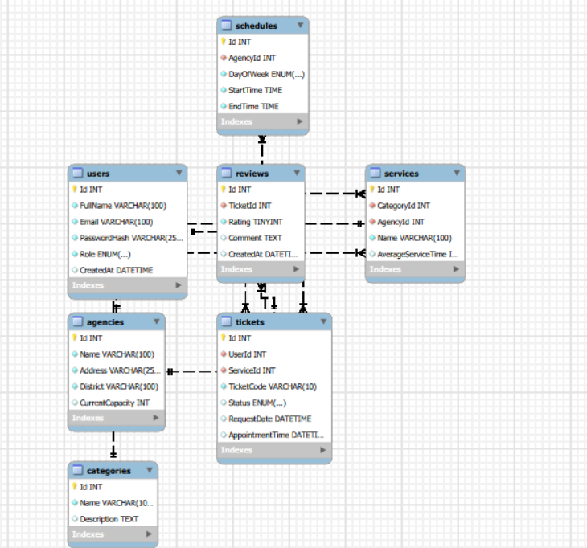
#### 4.8.1. Database Diagrams

## Capítulo V: Product Implementation, Validation & Deployment

### 5.1. Software Configuration Management
#### 5.1.1. Software Development Environment Configuration
#### 5.1.2. Source Code Management
#### 5.1.3. Source Code Style Guide & Conventions
#### 5.1.4. Software Deployment Configuration

### 5.2. Landing Page, Services & Applications Implementation
#### 5.2.1. Sprint 1
